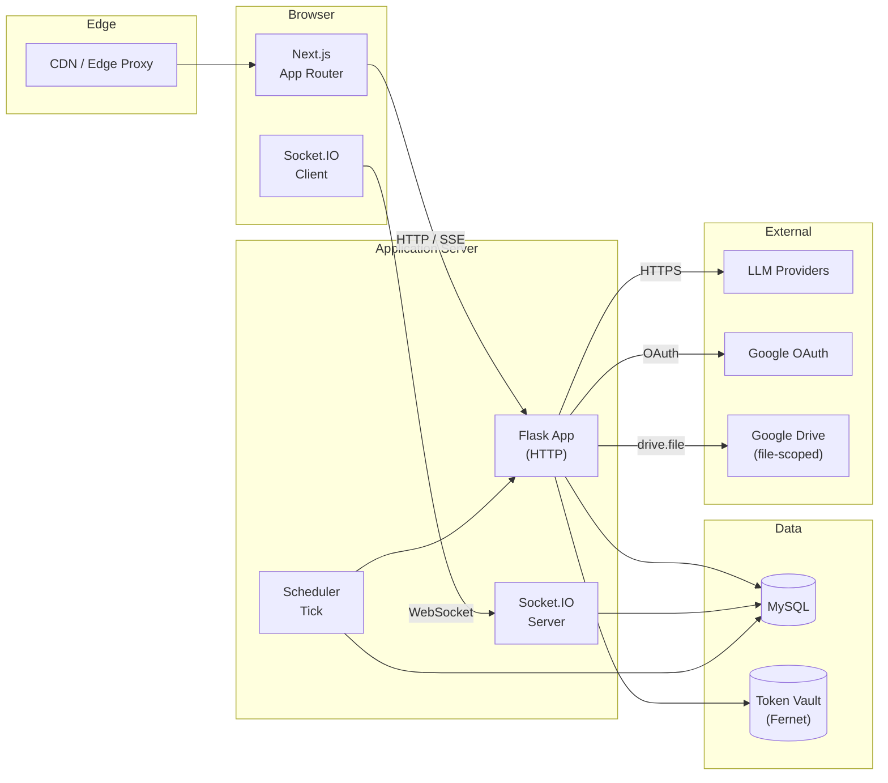
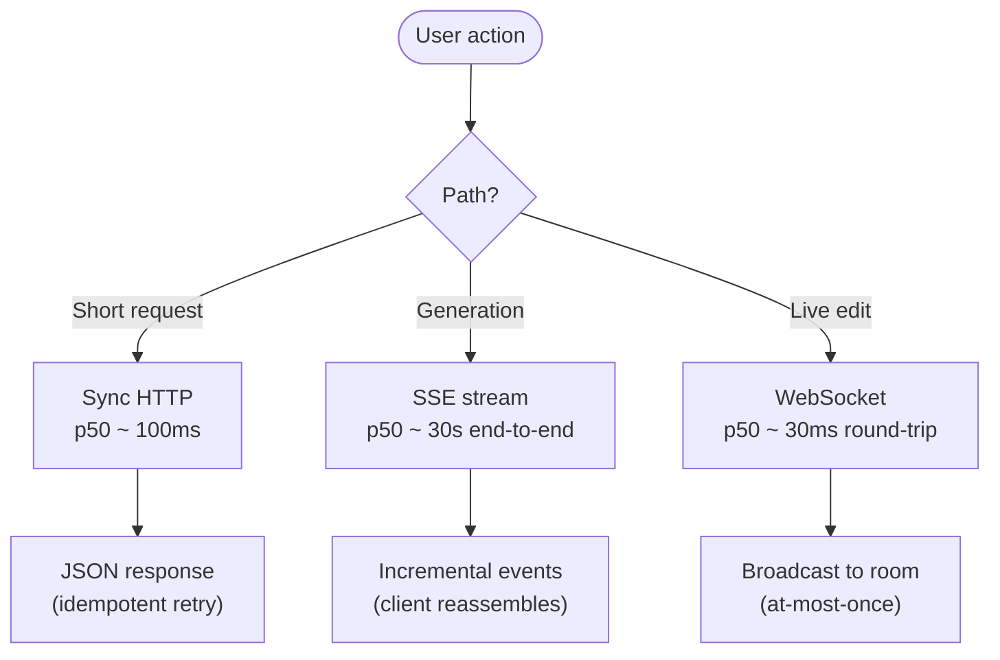
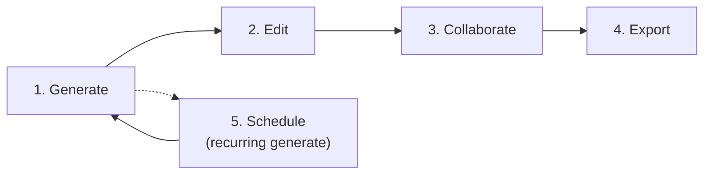
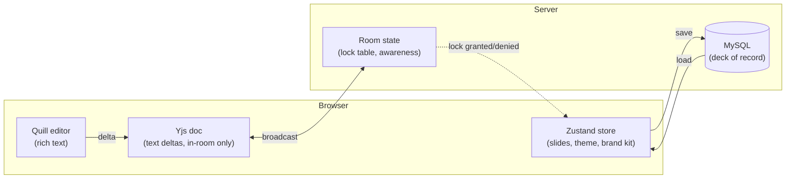

# 1. System Overview

SlideMaker is a single-team production system that turns a natural-language
prompt (and optionally a document) into a structured slide deck a user can
edit, share, and collaborate on in real time. This document describes the
high-level shape of the system: what processes exist, how they communicate,
and where the synchronous and asynchronous paths run.

## 1.1 Process boundaries

The system is composed of three long-running processes, a managed datastore,
and several external services. There is no microservice mesh; the single
backend process is a deliberately monolithic Flask application.

### 1.1.1 The three processes

| Process | Runtime | Role |
|---------|---------|------|
| **Next.js** | Node.js | Renders the public site and the editor SPA; performs SSR for marketing pages; proxies API and auth calls to the application server. |
| **Flask application** | Python | All business logic. Hosts the REST API, the Socket.IO server, and the in-process scheduler tick. |
| **Edge proxy** | Managed | Terminates TLS, applies edge caching for the public site, and routes WebSocket connections to the application origin without buffering. |

### 1.1.2 Why one application process

A microservice split would require a separate AI worker, a separate
collaboration worker, and a message bus to coordinate them. For a single-team
system at this scale, the operational cost of running and observing four
processes is greater than the cost of keeping the application monolithic.
When the bottleneck shifts, the first split will be the LLM-calling code (it
is the only path that is both slow and embarrassingly parallel); not the
collaboration server, not the scheduler.

## 1.2 Request paths

Three distinct request paths exist. Each has different latency, durability,
and failure-recovery characteristics.

### 1.2.1 Synchronous HTTP

Used for: auth, profile, listing decks, fetching a deck, saving a deck,
template metadata, billing-adjacent flows.

These are idempotent or near-idempotent operations with a short critical
section. The client uses an axios instance with a session-id interceptor;
the server uses standard Flask request handlers backed by SQLAlchemy.

### 1.2.2 Server-Sent Events (SSE)

Used for: AI-driven slide generation, where the user sees slides appear one
at a time as the LLM produces them. SSE is preferred over a single
long-blocking POST because it gives the user feedback after the first
~3 seconds (when the first slide arrives) rather than after the full ~30
seconds of the run.

A full discussion of the streaming protocol — event types, reassembly,
reconnection — is in [chapter 4](04-streaming-protocol.md).

### 1.2.3 WebSocket (Socket.IO)

Used for: real-time collaboration. Cursor positions, awareness updates, Yjs
text deltas, and pessimistic lock requests for non-text elements all flow
through a single Socket.IO session per editor tab. The server is configured
to accept only the WebSocket transport, not the long-polling fallback; the
reasons are in [chapter 9](09-concurrency-model.md) and
[ADR-001](decisions/ADR-001-websocket-only-transport.md).

## 1.3 The five end-to-end flows

The system has surprisingly few user-facing flows. Most user value compresses
into one of these:

| # | Flow | Dominant path | Discussed in |
|---|------|---------------|--------------|
| 1 | Generate a deck from a prompt | SSE | [chapter 2](02-generation-pipeline.md) |
| 2 | Edit slides in the canvas | Sync HTTP | [chapter 5](05-theme-and-brand-kit.md) |
| 3 | Collaborate live with others | WebSocket | [chapter 3](03-collaboration.md) |
| 4 | Export to PPTX / PDF / Google Slides | Sync HTTP + OAuth | [chapter 7](07-oauth-and-token-vault.md) |
| 5 | Schedule recurring generation | Scheduler tick + SSE | [chapter 8](08-scheduled-decks.md) |

## 1.4 What lives in the browser, what lives on the server

A common confusion in editor-style web apps is *where* the document state of
record lives. SlideMaker's answer: the **server is the source of truth**;
the browser holds a *projection* that can diverge during an editing session
and is reconciled back to the server.

- **Zustand store** holds the working copy of slides, theme, and brand kit
  in the browser. It is persisted to MySQL on save and via auto-save.
- **Yjs document** is per-collab-room ephemeral state for text. It is
  *not* the durable store; on a clean reload, slides re-hydrate from
  MySQL and a fresh Yjs doc starts.
- **Quill editor** is the rich-text surface for each text element; its
  Deltas flow into Yjs.
- **Room state** lives in memory on the application server. It tracks
  who is in the room, who holds which element lock, and is throw-away
  on server restart (locks reset to free, awareness re-syncs as users
  reconnect).

## 1.5 What this system is not

To set expectations for the rest of the document:

- **Not horizontally scaled.** There is one application origin. The
  collaboration protocol assumes this and would need significant work to
  shard (sticky sessions, cross-node lock coordination). See
  [chapter 9](09-concurrency-model.md).
- **Not a multi-tenant SaaS in the enterprise sense.** No per-tenant
  isolation guarantees beyond user-level row scoping in the database.
- **Not built on a managed platform.** No serverless functions, no managed
  queues, no managed websocket gateway.
- **Not "agentic."** The AI calls are bounded, structured prompt patterns
  that produce JSON. There is no autonomous loop, no tool use beyond
  document-content extraction.

Each subsequent chapter takes one slice of this picture and goes deep.
