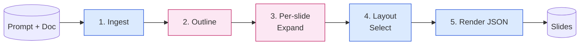
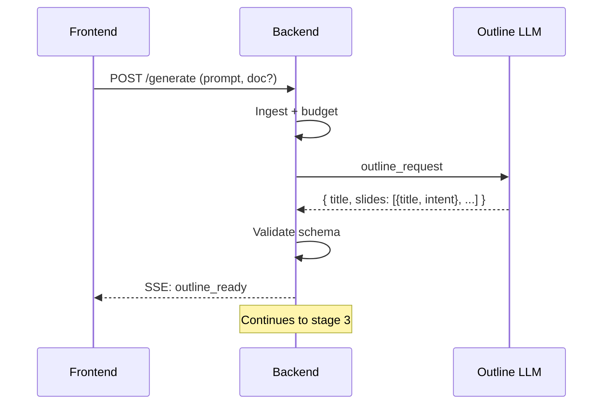
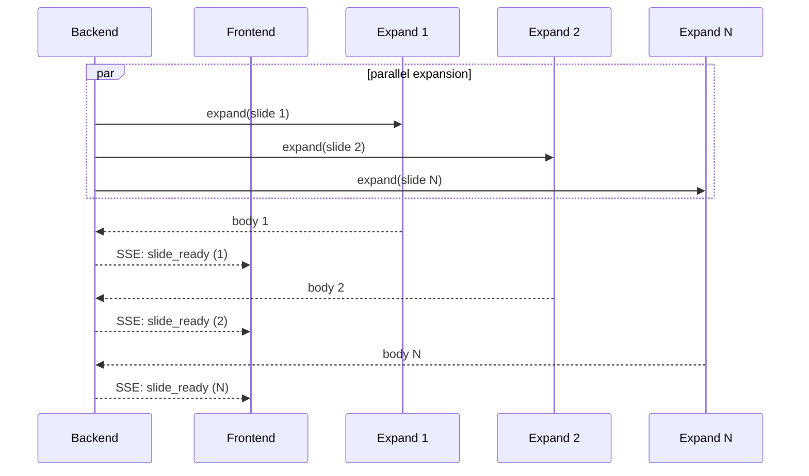
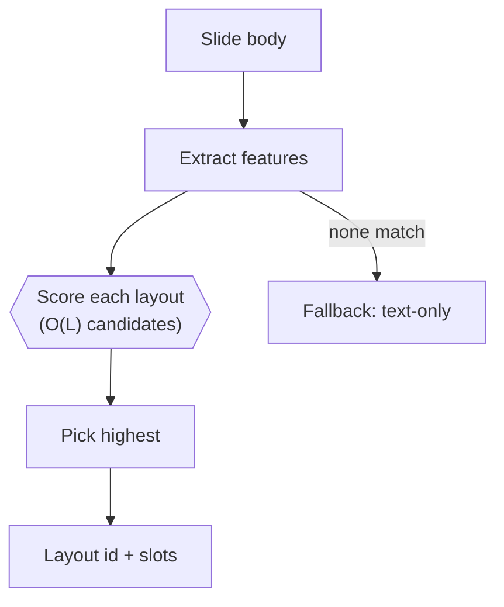
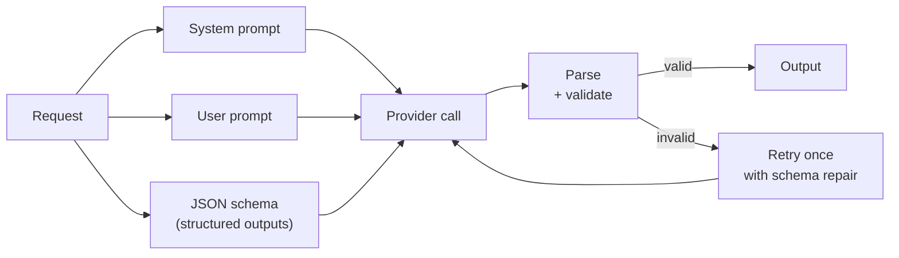

# 2. Generation Pipeline

The user types a topic, optionally attaches a document, and ~30 seconds later
has a 10-slide deck. This chapter describes what happens in those 30 seconds.

## 2.1 Pipeline stages

A generation run flows through five distinct stages. Each stage's output is
the next stage's input; each stage can fail independently and has its own
retry policy.

| Stage | Kind | Latency contribution | Failure recovery |
|-------|------|----------------------|------------------|
| 1. Ingest | Deterministic | ~50 ms (no doc) – ~2 s (doc) | Retry once, then surface |
| 2. Outline | LLM call | ~3 s | Retry with smaller context |
| 3. Per-slide expand | LLM calls × N | ~2 s each, parallel | Per-slide retry, skip on failure |
| 4. Layout select | Deterministic | < 100 ms | Fall back to text-only layout |
| 5. Render JSON | Deterministic | < 200 ms | Skip slide, continue |

### 2.1.1 Ingest

If a document is attached (PDF, DOCX, URL, text paste), the ingest stage
extracts text and runs a chunking algorithm to compress it to a budget the
LLM can comfortably handle. The chunking method is described in a separate
research paper; the short version is that position-aware chunking with
content quality signals outperforms semantic chunking for this task at a
fraction of the cost.

Output of this stage is a structured input bundle: the prompt, the audience
hint (if any), the target slide count, and an optional `context_block` that
the LLM is instructed to draw from.

### 2.1.2 Outline

A single LLM call produces the structural skeleton of the deck: a title, a
list of slide titles, and a one-sentence "intent" for each slide. The
outline is *strict JSON*; the response is parsed and schema-validated. If
parsing fails, the request is retried once with the schema injected into
the system message; if it fails again, the run aborts.

The outline is sent to the client as the first SSE event (`outline_ready`)
so the user sees the deck's shape *before* any individual slide finishes
generating. This single event accounts for most of the perceived
responsiveness of the system.

### 2.1.3 Per-slide expand

For each entry in the outline, an LLM call expands the one-sentence intent
into the slide's body content: bullets, paragraphs, optional chart data,
optional table rows. These calls are fired off concurrently with a bounded
concurrency limit.

Slides are emitted in the order their responses arrive, **not** in their
outline order. The client keeps the outline as the ordered skeleton and
fills each slot as the matching `slide_ready` event arrives. This is what
gives the visible "slides popping in" effect.

### 2.1.4 Layout select

The body content for each slide is matched to a layout from the active
theme's layout registry. The matcher is a deterministic function: given
`(slide kind, bullet count, has_chart, has_table, has_image_intent)` it
returns the layout id with the best fit score. There is no LLM in this
stage. This is intentional — layout choice is a structured decision with a
small search space, and LLMs are slower and less reliable than a hand-tuned
classifier for this kind of problem.

### 2.1.5 Render JSON

The final stage emits the slide as the JSON shape the client renders. This
includes element placement (x, y, w, h), text content (as Quill Deltas),
chart data, table data, colors resolved against the active brand kit (see
[chapter 5](05-theme-and-brand-kit.md)), and references to logos and images.

The output is *plain data*: it can be saved to the database, broadcast to
collaborators, or fed back to the client to repaint the canvas.

## 2.2 Why split outline from expansion

A natural alternative is "one LLM call generates the whole deck." That
approach was tried and discarded for three reasons:

1. **Latency feel.** A single 30-second blocking LLM call gives the user
   zero feedback for 30 seconds. The split version gives feedback in 3 s
   (outline) and progressively for the next 27 s.
2. **Token efficiency.** Per-slide calls can be parallelized; a single call
   cannot.
3. **Error isolation.** If slide 7 fails, only slide 7 retries. In the
   single-call model, any malformed JSON aborts the entire deck.

The cost is that the outline must commit before the slides do: the
"intent" the outline sets for slide 7 cannot be revised based on what slide
6 ended up containing. In practice this rarely matters because the outline
is high-level enough to leave room for the expander.

## 2.3 The shape of an LLM call

All LLM calls in the system follow the same envelope:

Validation is *not* optional. Every LLM response is parsed against a strict
schema before it is allowed into the rest of the pipeline. Schema failures
trigger a single targeted retry that includes the schema and the bad output
in the next system message; this catches almost all single-shot mistakes.
A second failure aborts the call.

## 2.4 What is fast, what is slow

A rough breakdown of a 10-slide run, from the user's first keystroke to the
final slide painting:

```mermaid
gantt
    title End-to-end timeline (~30s, 10 slides)
    dateFormat X
    axisFormat %S s

    section Network
    Request travel        :a1, 0, 1
    section Ingest
    Doc extract + chunk   :a2, 0, 2
    section Outline
    Outline LLM           :a3, 2, 5
    SSE outline_ready     :milestone, m1, 5, 0s
    section Expand
    Slide 1               :a4, 5, 7
    Slide 2               :a5, 5, 7
    Slide 3               :a6, 5, 7
    Slide 4               :a7, 7, 9
    Slide 5               :a8, 7, 9
    Slide 6               :a9, 9, 11
    Slide 7               :a10, 11, 13
    Slide 8               :a11, 13, 15
    Slide 9               :a12, 15, 17
    Slide 10              :a13, 17, 19
    section Finalize
    Save to DB            :a14, 19, 21
    Client repaint        :a15, 21, 22
```

LLM latency dominates. Everything else — ingest, layout matching, render
JSON, database write — is sub-second.

## 2.5 Determinism in a non-deterministic pipeline

LLMs are non-deterministic by construction, but the pipeline around them is
fully deterministic. Given the same outline output and the same expansion
outputs, the layout selection, render JSON, and final slide structure are
byte-identical. This matters for two reasons:

- **Reproducibility for debugging.** When a user reports "this deck looks
  wrong," replaying the stored LLM responses through the deterministic
  layers produces the same broken output, so the bug can be isolated to
  the LLM step or to one of the post-LLM steps.
- **Caching.** Identical outline + expansion outputs are cached by hash,
  so repeated runs with the same inputs skip the layout/render stages.

## 2.6 Where this connects to the rest of the system

- The streaming format used to emit `outline_ready` and `slide_ready` is
  defined in [chapter 4](04-streaming-protocol.md).
- The render JSON references theme layout slots and brand kit colors,
  defined in [chapter 5](05-theme-and-brand-kit.md).
- Scheduled decks run this exact pipeline on a cron tick, described in
  [chapter 8](08-scheduled-decks.md).
- Failure recovery for each stage is enumerated in
  [chapter 10](10-failure-modes.md).
