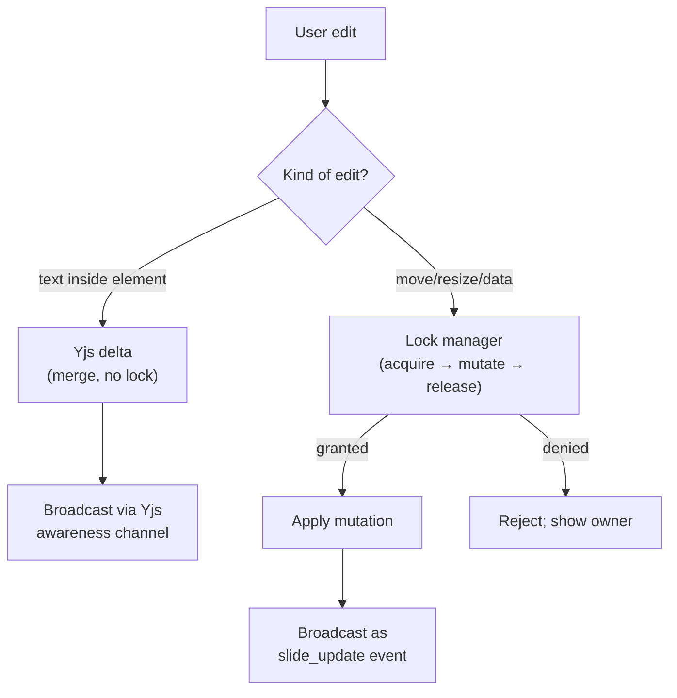
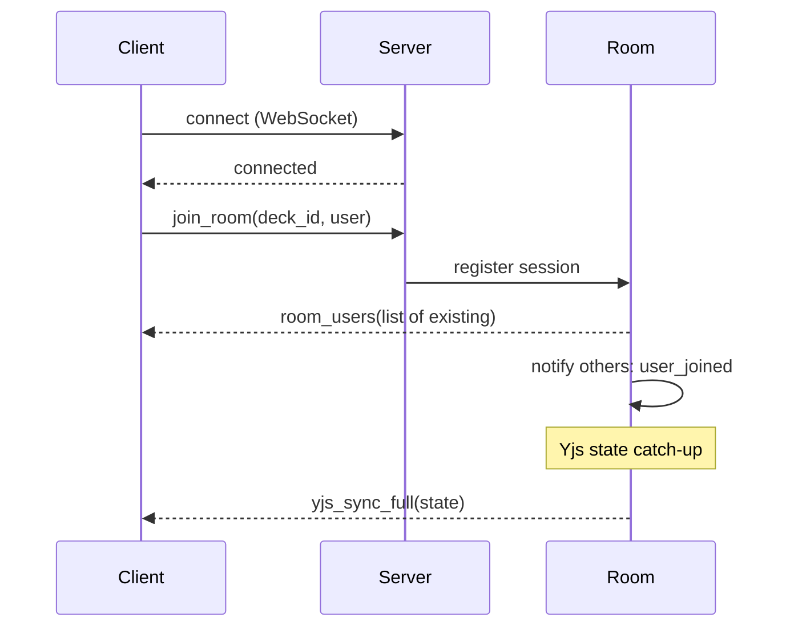
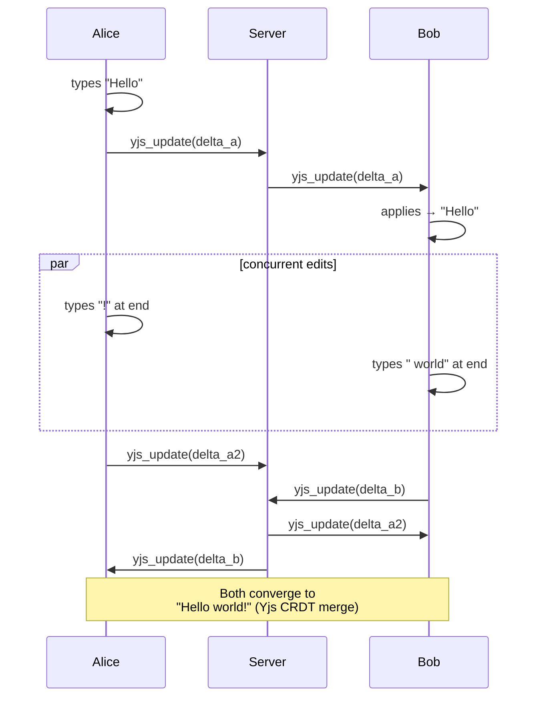
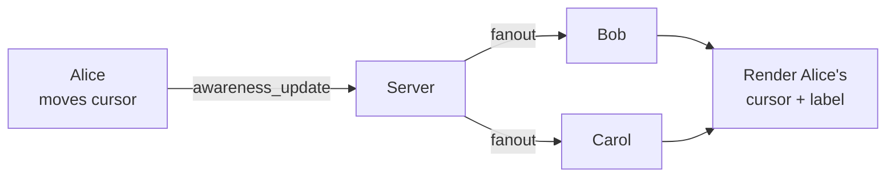
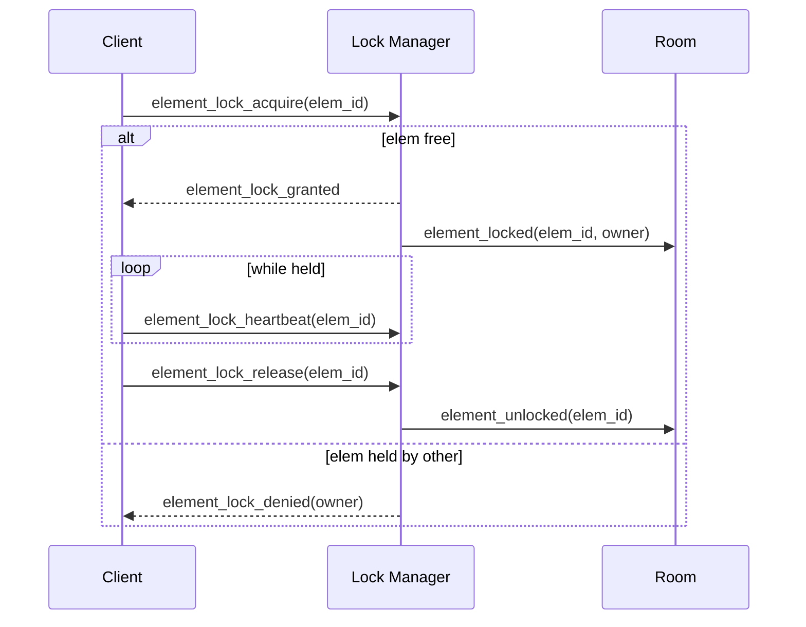
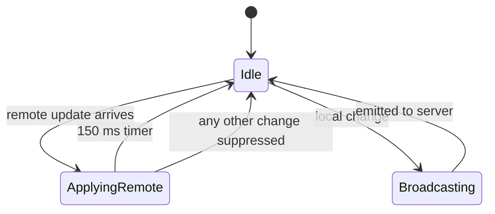
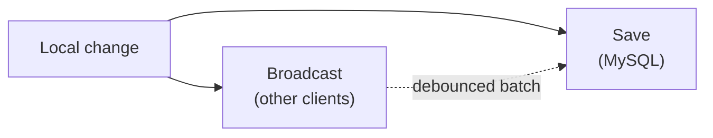

# 3. Real-Time Collaboration

SlideMaker supports multiple users editing the same deck simultaneously,
with live cursors, presence indicators, and per-element protection against
conflicting edits. The collaboration layer is a *hybrid* of two well-known
patterns: a CRDT for text and pessimistic locks for everything else. This
chapter explains why the hybrid exists and how it works.

## 3.1 The two-mode problem

Editing a slide deck combines two very different editing surfaces:

1. **Text inside a text element** — many small, mergeable edits, often
   typed by two people at once into different parts of the same paragraph.
2. **Everything that isn't text** — moving a shape, resizing an image,
   replacing a chart's data, changing a table's structure. These are
   coarse-grained, hard-to-merge operations.

The right tool for (1) is a CRDT: it merges concurrent insertions cleanly
without needing a server to arbitrate. The right tool for (2) is a lock:
two people dragging the same rectangle in different directions has no
sensible "merged" result, and any auto-merge will produce a glitched
position. We use **Yjs** for text and a **pessimistic lock manager** for
everything else.



## 3.2 Room model

A **room** is one editing session for one deck. Joining a room means
opening a Socket.IO session, sending a `join_room` event with the deck id
and a user identity, and receiving back the current room state.



Once joined, four channels of traffic flow between client and server:

| Channel | Direction | Cardinality | Purpose |
|---------|-----------|-------------|---------|
| Yjs sync | bidirectional | broadcast | Text deltas + initial state catch-up |
| Awareness | bidirectional | broadcast | Cursor position, user color, active element |
| Slide update | bidirectional | broadcast (excluding sender) | Non-text mutations |
| Element locks | bidirectional | request/response + broadcast | Lock acquire/release/heartbeat |

## 3.3 Yjs sync

Yjs is a CRDT library. Each client and the server hold a copy of the same
Yjs document. Local edits produce *updates* (binary deltas) that are
broadcast to every other client in the room; remote updates are applied to
the local doc. Conflicts are merged deterministically by the algorithm; no
server arbitration is required.



The server in this flow is a pure broadcaster for Yjs traffic. It does not
inspect or transform the updates. The only place it touches the Yjs doc is
when a new client joins and needs the catch-up state.

## 3.4 Awareness (cursors and presence)

Awareness is everything that *isn't* the document itself: who is in the
room, what color is assigned to them, where their cursor is, and which
element they currently have focused.

Awareness updates are *transient* — they are broadcast to other clients
and never persisted. If the server restarts, awareness is lost and rebuilt
as clients send their next update.



Each user is assigned a color deterministically from a hash of their user
id, so the same person looks the same across sessions and across other
users' screens.

## 3.5 Pessimistic locks for non-text edits

For non-text mutations — moving a shape, changing chart data, replacing an
image — a pessimistic lock model is used:

1. When a user **focuses** a non-text element, the client requests a lock.
2. The server's lock manager grants or denies based on the current owner.
3. While the lock is held, the client may mutate the element freely; all
   other clients see a "locked by Alice" overlay on that element.
4. The client sends a **heartbeat** every few seconds while the lock is
   held; missing heartbeats cause the lock to expire.
5. On blur or unmount, the client **releases** the lock.



### 3.5.1 Lock state

The lock manager keeps an in-memory table per room:

```
element_id  →  { owner_session, acquired_at, last_heartbeat }
```

This state is intentionally *not* persisted. On server restart, all locks
reset to free; clients re-acquire as users refocus elements. The user
experience is a brief flicker, not data loss.

### 3.5.2 Why pessimistic, not optimistic

An optimistic model — let everyone mutate, reconcile after — could in
principle work for non-text edits with operational transforms. In practice,
the UX of "your move was undone because someone else moved it first" is
worse than "you can't move this right now because someone else is." The
pessimistic model also avoids needing to ship OT logic for every element
kind.

## 3.6 The two-flag echo-loop guard

Both Yjs updates and slide_update events flow through the same Socket.IO
session. When a local edit is broadcast, the same change must not bounce
back from the server and be re-applied locally as if it came from a remote
client. The guard is a pair of module-scoped flags:

- `isApplyingRemote` — set true while a remote update is being applied;
  the broadcast subscription checks this flag and skips re-broadcasting.
- `lastRemoteUpdate` — a per-slide `{ slideIndex, timestamp }`; if a local
  change matches the slide of a remote update received within 200 ms, the
  broadcast is suppressed as an echo.



The 150 ms / 200 ms windows are deliberately *just* long enough to cover
the round-trip and store-subscription tick, and deliberately *just* short
enough to not suppress a genuine quick local edit after a remote one.

The history of this guard, including the StrictMode double-mount bug that
made the original implementation insufficient, is in
[case-studies/echo-loop.md](case-studies/echo-loop.md).

## 3.7 What is broadcast vs what is saved

A useful mental model: there are two write paths in collaboration.



The broadcast path runs immediately; collaborators see the change in
< 50 ms. The save path is debounced and batched; the database catches up
within a few seconds. If the user closes their tab after the broadcast but
before the save, the change is preserved in collaborators' Yjs / slide
state and reaches the database via the next save from any of them.

## 3.8 Limits of the current model

- **Single application origin.** Lock state lives in process memory; a
  horizontally scaled collab tier would need either sticky sessions or a
  shared lock store (Redis, etc).
- **No offline editing.** A disconnected client cannot edit; Yjs supports
  offline-first patterns, but the rest of the system (auth, save) does
  not, so this is artificially gated.
- **No cross-deck cursor.** Awareness is per room, by design.

## 3.9 Connections to other chapters

- The Socket.IO transport choice and worker affinity are in
  [chapter 9](09-concurrency-model.md).
- Bug stories: [echo-loop](case-studies/echo-loop.md),
  [late-login anonymous identity](case-studies/late-login-anonymous-id.md).
- The decision to use Yjs over Operational Transform is in
  [ADR-002](decisions/ADR-002-yjs-over-ot.md).
- The decision to use pessimistic locks over OT for non-text elements is
  in [ADR-003](decisions/ADR-003-pessimistic-element-locks.md).
