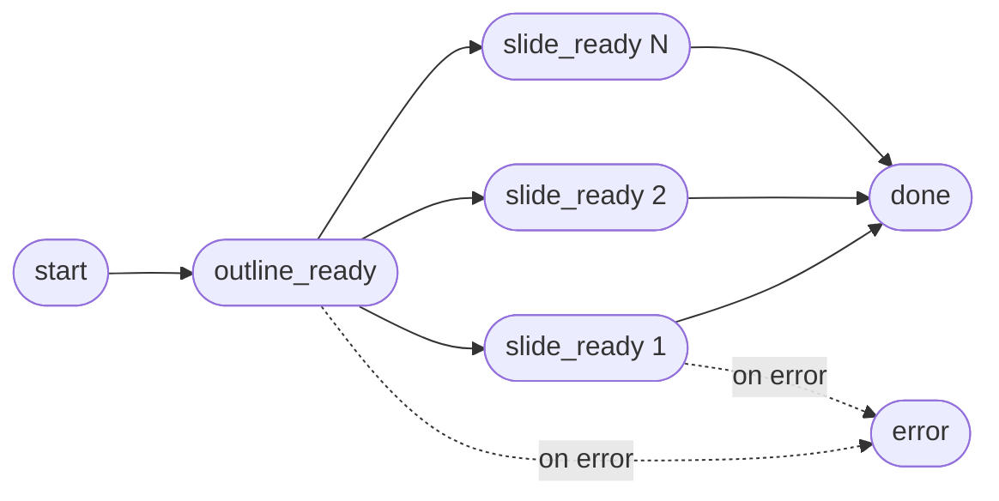
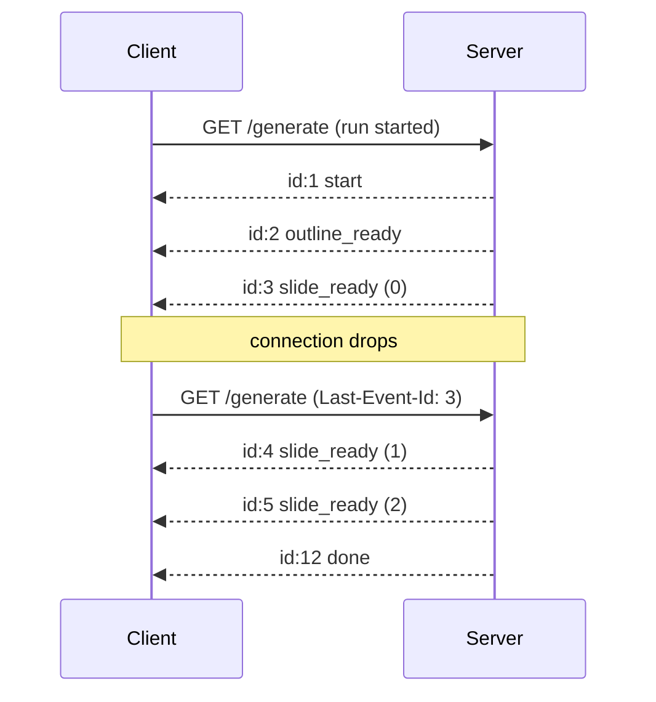
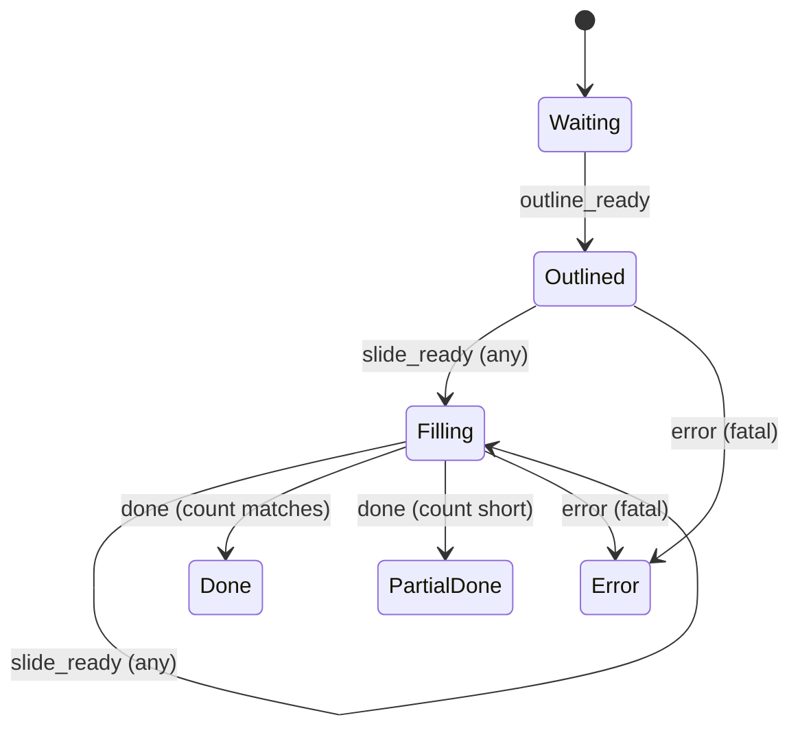

# 4. Streaming Protocol

The generation pipeline (chapter 2) emits slides one at a time as they
finish. This chapter documents the wire protocol used to deliver them to
the browser: Server-Sent Events (SSE) over HTTP/1.1.

## 4.1 Why SSE, not WebSocket

The two natural choices for incremental delivery are WebSocket and SSE.
SSE wins here for three reasons:

1. **Generation is one-way.** The server emits; the client consumes. SSE
   is built for exactly this shape. WebSocket adds bidirectional framing
   the client does not need.
2. **No transport ambiguity.** SSE is plain HTTP. It works through every
   CDN and proxy without special configuration. The collaboration WebSocket
   is a separate concern (chapter 3) and pays its own configuration cost
   only once.
3. **Reconnection is built in.** Browsers auto-reconnect SSE streams and
   replay from the last received event id if the server cooperates. The
   collaboration WebSocket layer reconnects too, but the SSE primitive is
   one less line of client code.

## 4.2 Event types

A generation stream emits five event types, in roughly this order:



| Event | Payload | Idempotent on retry |
|-------|---------|---------------------|
| `start` | `{ run_id, slide_count_target }` | yes |
| `outline_ready` | `{ title, slides: [{ index, title, intent }, ...] }` | yes |
| `slide_ready` | `{ index, slide: { layout, elements, ... } }` | yes |
| `done` | `{ run_id, slide_count }` | yes |
| `error` | `{ stage, message, fatal }` | yes |

All payloads are JSON. The `run_id` is a server-generated identifier that
the client can include in a follow-up reconnect to resume the stream from
where it left off (when the server supports replay; see § 4.4).

## 4.3 Wire format

The events are emitted in the standard SSE format:

```
event: outline_ready
id: 2
data: {"title":"Q1 Plan","slides":[{"index":0,"title":"...","intent":"..."}]}

event: slide_ready
id: 3
data: {"index":0,"slide":{...}}

event: slide_ready
id: 4
data: {"index":2,"slide":{...}}

event: done
id: 12
data: {"run_id":"...","slide_count":10}
```

Two details worth noting:

- The blank line is the event delimiter.
- `id` is monotonically increasing per stream and is what the browser
  echoes back in `Last-Event-Id` on a reconnect.

## 4.4 Reconnection and replay

If the connection drops mid-stream, the browser automatically reconnects to
the same URL with `Last-Event-Id` set to the last id it received. The
server uses this id to skip any events the client already has:



Replay requires the server to hold the emitted-event log for the lifetime
of the run. The log is bounded (a 10-slide deck produces ~13 events) and
discarded shortly after `done`.

## 4.5 Client reassembly

The outline event arrives first and tells the client how many slides to
expect and in what order. Subsequent `slide_ready` events arrive in
*completion* order, not outline order. The client maintains a sparse array
indexed by slide position and fills in slots as they arrive:



The "completed" UI state requires both:

1. `done` event received, and
2. Every slot in the outline filled (or explicitly marked skipped).

A `done` with missing slots transitions to `PartialDone`, which the UI
renders with a "some slides failed; retry?" affordance.

## 4.6 Backpressure

LLM expansion is the bottleneck and naturally rate-limits the stream. The
backend never emits faster than the LLM finishes a slide; the client never
needs to buffer more than the size of one slide's JSON. There is no
explicit backpressure protocol because none has been needed.

## 4.7 Timeouts

Three timeouts apply:

| Timeout | Scope | Value (order of magnitude) | Action on expiry |
|---------|-------|----------------------------|------------------|
| Per-LLM-call | Stage 2 or 3 | ~30 s | Retry once, then `error` event |
| Per-slide | A single slide_ready | ~60 s | Mark slot skipped, continue |
| Whole run | start → done | ~5 min | Abort, emit `error fatal` |

The whole-run timeout exists to cover the case where the LLM provider
stalls on a single call. Without it, a stuck stream could hold a request
slot indefinitely.

## 4.8 Why not just buffer and return a single response

Three reasons SSE beats a single blocking response for this workload:

1. **Time-to-first-byte.** The outline can be on screen in ~3 s. A blocking
   call delivers nothing until the last slide finishes (~30 s).
2. **Visible progress.** Slides appear as they finish; the user can start
   reviewing slide 1 while slide 9 is still generating.
3. **Partial success.** A single error in slide 7 does not waste the
   completed work in slides 1–6.

## 4.9 Connections to other chapters

- The pipeline that *produces* these events is in
  [chapter 2](02-generation-pipeline.md).
- Recovery paths for generation errors are in
  [chapter 10](10-failure-modes.md).
- Scheduled decks reuse the same pipeline but discard the SSE stream
  server-side; see [chapter 8](08-scheduled-decks.md).
