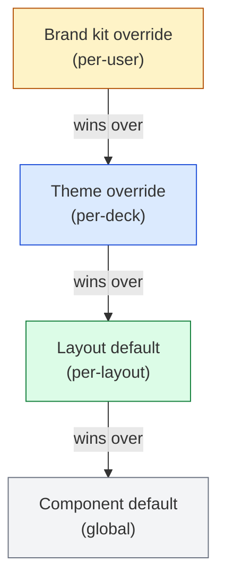
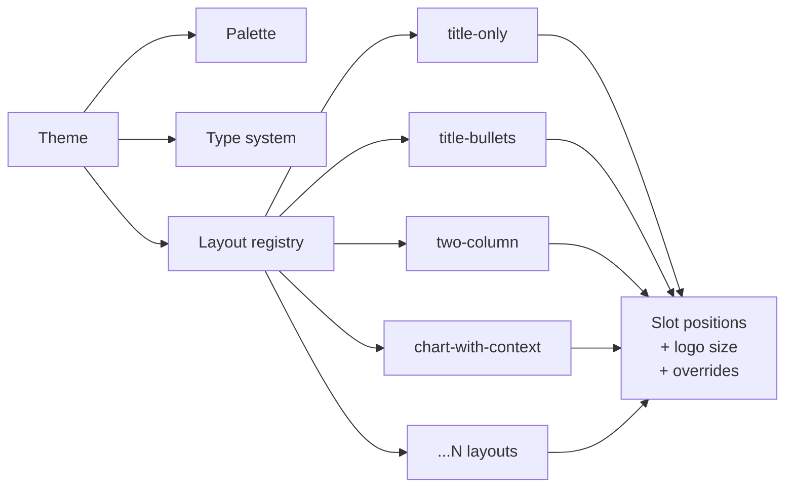
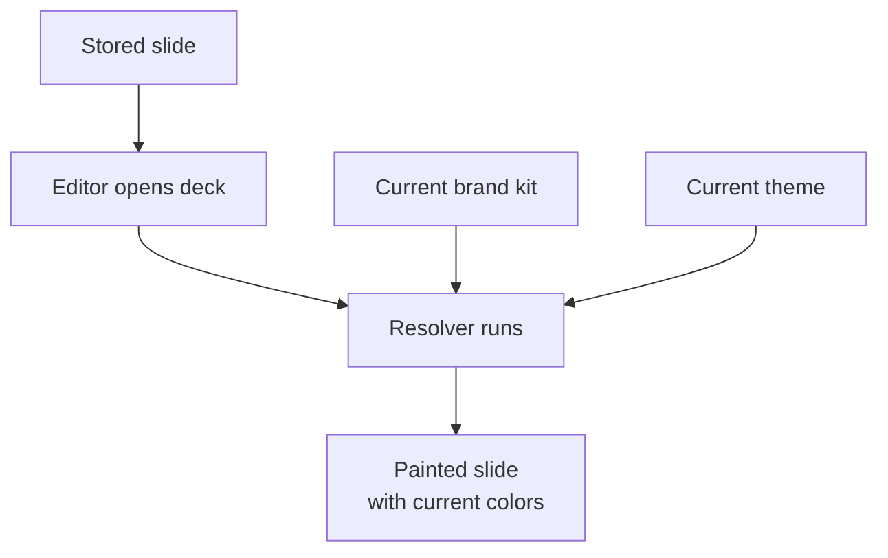
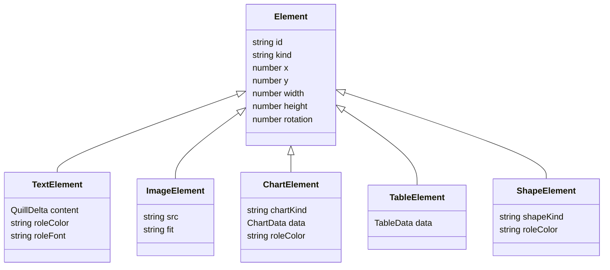

# 5. Theme & Brand Kit

A slide's final appearance is the result of layering four sources of
style: the component default, the layout default, the theme override, and
the brand kit override. This chapter formalizes that layering and explains
the data structures behind it.

## 5.1 The precedence stack

For any styled property (color, font family, font size, logo size,
spacing), the resolved value is the highest-priority source that has
declared a value:



The precedence is a *pure function* applied during render. There is no
mutation: the theme does not modify the layout; the brand kit does not
modify the theme. Each render pass walks the stack from the top and
returns the first declared value.

## 5.2 Theme as a registry

A theme is a bundle of:

- A **palette** — primary, secondary, accent, surface, on-surface, etc.
- A **type system** — display, heading, body, caption, code.
- A **layout registry** — a set of named layouts, each describing slot
  positions, sizes, and per-layout style overrides.



The layout registry is the part that matters most for visual identity.
Two themes with the same palette but different layout registries look like
different products; two themes with different palettes but the same
registries look like recolors of the same product.

### 5.2.1 Per-layout logo size

A single deck-wide logo size produces a logo that is too big on a
title-only slide and too small on a chart-with-context slide. The layout
registry therefore declares logo dimensions *per layout*, and the renderer
uses the layout's declaration when placing the brand kit logo. This is a
small detail that visibly improves polish.

## 5.3 Brand kit as a top-of-stack override

A brand kit is a per-user record containing:

- Primary, secondary, and accent colors.
- A logo image reference.
- An optional font family override.

At render time, the brand kit's declared values *replace* the theme's
declared values for the same role. The resolver is a function:

```
resolve(role, brand_kit, theme, layout) =
    brand_kit[role]   if declared
    theme[role]       if declared
    layout[role]      if declared
    component_default[role]
```

There is intentionally no "blend" or "tint" logic. Either the brand kit
declares a color or it does not; if it does, that color wins outright.

## 5.4 Where the resolver runs

The resolver runs in two places:

1. **At generation time**, when the render JSON for a new slide is being
   constructed. The resolved colors are baked into the slide's elements.
2. **At load time**, when an existing slide is opened in the editor. The
   resolver re-runs against the current brand kit, so changes to the
   brand kit propagate to previously generated slides on next view.



This is what makes a brand kit feel "global" — changing one color in the
brand kit visibly retints every deck the user owns on next view.

## 5.5 The override that ate the title color

A subtle bug class is "brand kit overrides a role you didn't mean to
override." For example: setting the brand kit's primary color to a deep
blue ends up coloring every title in every deck deep blue, even on themes
where titles are deliberately the theme's display color and not the
primary.

The current model defines a small set of *roles* (title color, body color,
accent color, surface color, on-surface color) and brand kit colors map to
roles, not to specific element properties. This makes the override
predictable: if the brand kit overrides the title-color role, every title
in every theme picks up that color; if it overrides only the accent role,
titles are untouched.

The case study [brand-kit-color-override](case-studies/brand-kit-color-override.md)
walks through the specific incident that motivated this refinement.

## 5.6 Element data model

Each slide is an array of elements. Each element is a typed record with
position, size, and type-specific content:



The key design choice: elements declare their style by *role*, not by
literal value. A title element declares `roleColor: "title"`, not
`color: "#0033AA"`. The resolver maps the role to a concrete value at
render time using the brand-kit-then-theme-then-layout chain.

This makes brand kit propagation cheap (no slide rewrite required) and
keeps the slide stable across theme swaps.

## 5.7 Rich text content (Quill Deltas)

Text content inside a text element is stored as a [Quill
Delta](https://quilljs.com/docs/delta/) — an ordered list of insert/
attribute operations. Deltas are mergeable (they back the Yjs sync in
chapter 3), and they survive theme swaps because they carry semantic
attributes (bold, italic, link) without carrying concrete colors or
font sizes. Concrete styling is reapplied by the resolver at render time.

## 5.8 Connections to other chapters

- The slide JSON described here is what the streaming protocol carries
  in `slide_ready` events; see [chapter 4](04-streaming-protocol.md).
- The Quill Delta inside text elements is the input to Yjs sync; see
  [chapter 3](03-collaboration.md).
- The brand kit override incident is in
  [case-studies/brand-kit-color-override.md](case-studies/brand-kit-color-override.md).
