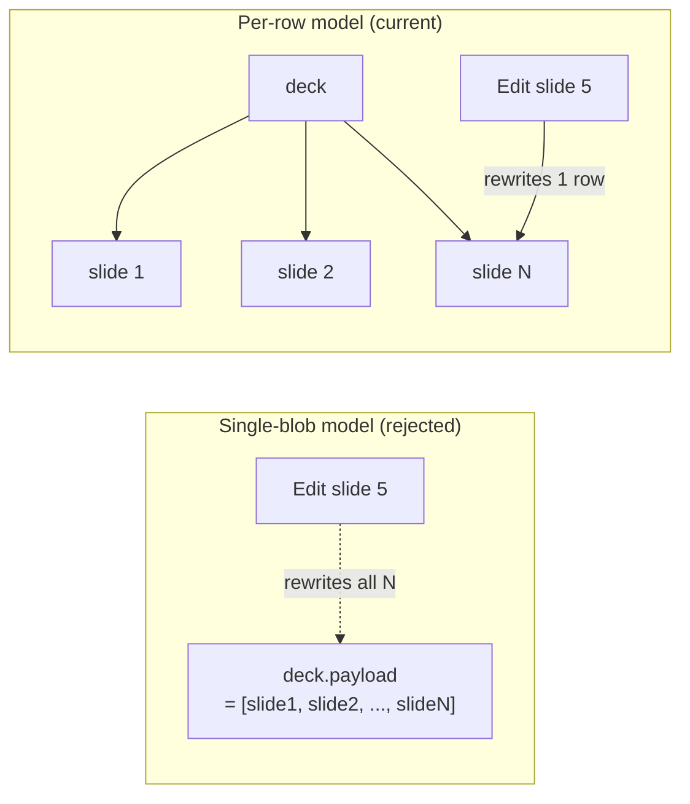
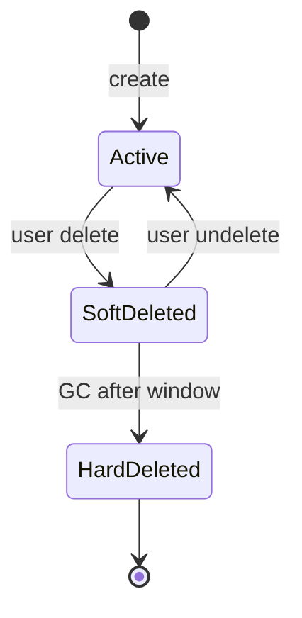

# 6. Storage Model

This chapter describes the persistence design at the *entity* level. It
deliberately avoids real column names, foreign-key constraints, or
migration history; the goal is to make the choices and trade-offs
legible, not to provide a schema you could copy.

## 6.1 Entity-relationship overview

The system has a small set of long-lived entities. Most reads and writes
touch fewer than three of them.

```mermaid
erDiagram
    USER ||--o{ DECK : owns
    USER ||--|| BRAND_KIT : has
    USER ||--o{ SCHEDULE : creates
    DECK ||--o{ SLIDE : contains
    DECK }o--|| THEME : uses
    DECK ||--o{ SHARE : shared_via
    SCHEDULE ||--o{ RUN : produces
    RUN ||--o| DECK : creates
    USER ||--o{ OAUTH_TOKEN : authorizes
    DECK ||--o{ EXPORT_JOB : exported_as

    USER {
      id
      identity
      created_at
    }
    DECK {
      id
      title
      theme_id
      owner_id
      visibility
      updated_at
    }
    SLIDE {
      id
      deck_id
      position
      payload_json
      updated_at
    }
    THEME {
      id
      name
      registry_json
    }
    BRAND_KIT {
      id
      user_id
      palette_json
      logo_ref
    }
    SHARE {
      id
      deck_id
      mode
      token
      expires_at
    }
    SCHEDULE {
      id
      user_id
      cadence
      source
      next_run_at
      paused
    }
    RUN {
      id
      schedule_id
      started_at
      finished_at
      status
      deck_id
    }
    OAUTH_TOKEN {
      id
      user_id
      provider
      scopes
      ciphertext
    }
    EXPORT_JOB {
      id
      deck_id
      target
      status
    }
```

A short narrative for each:

| Entity | What it stores | Cardinality notes |
|--------|----------------|-------------------|
| `USER` | Identity, profile basics. | One per person. |
| `BRAND_KIT` | A user's color/font/logo overrides. | One per user. |
| `DECK` | A presentation. | Many per user. |
| `SLIDE` | One slide of a deck. | Many per deck; ordered by `position`. |
| `THEME` | A reusable visual template. | Shared across users. |
| `SHARE` | A token-based access grant for a deck. | One per share link. |
| `SCHEDULE` | A recurring generation specification. | Many per user. |
| `RUN` | One execution of a schedule. | Many per schedule. |
| `OAUTH_TOKEN` | Encrypted refresh tokens for external providers. | One per (user, provider). |
| `EXPORT_JOB` | An async export to PPTX/PDF/Google Slides. | Many per deck. |

## 6.2 Why `SLIDE` is a separate table

A natural alternative is to store every deck as a single `DECK.payload_json`
blob containing all its slides. That model was tried and abandoned for two
reasons:

1. **Write contention.** A 10-slide deck with five collaborators produces
   bursts of small writes. Serializing those into a single JSON blob
   means each save rewrites all 10 slides; isolating them to a per-slide
   row means each save touches one row.
2. **Slide-level operations.** Reordering, duplicating, and bulk-applying
   a theme are all per-slide operations. Keeping the row boundary aligned
   with the operation boundary keeps the queries simple.



The deck row itself stores only deck-level metadata (title, owner, theme
ref, visibility, timestamps). Heavy slide content lives on the slides.

## 6.3 What goes in `payload_json` on a slide

Each slide row stores its rendered structure as JSON: layout id, the
element array (chapter 5), and any per-slide overrides. This is the same
shape the generation pipeline produces and the same shape the editor
loads.

JSON is used (instead of fully normalized element tables) because:

- Element content is hierarchical and varied (charts and tables differ
  structurally from text and images); flattening it into rows costs more
  in joins than it saves in indexability.
- Slides are *almost always* read or written as a whole.
- Slide-level queries (e.g., "find slides with charts") are rare and
  acceptable as full scans.

The trade-off: there is no SQL way to query "find all decks that have a
chart with a certain data field." That has never been a needed query.

## 6.4 What lives in `THEME.registry_json`

A theme's layout registry is a structured but free-form JSON tree (see
chapter 5). Themes are read-heavy and write-rare, so storing them as
JSON blobs is fine; the only query that matters is "load theme by id."

## 6.5 Indexing strategy

Indexes are kept to the minimum required for the actual query paths:

| Index | Purpose |
|-------|---------|
| `deck (owner_id, updated_at)` | List a user's decks, newest first. |
| `slide (deck_id, position)` | Load a deck's slides in order. |
| `share (token)` | Resolve a share link to a deck. |
| `schedule (user_id, next_run_at)` | Scheduler tick: "what is due?" |
| `run (schedule_id, started_at)` | Schedule history listing. |
| `oauth_token (user_id, provider)` | OAuth callback handoff. |
| `export_job (deck_id, status)` | "Show me active exports for this deck." |

Indexes on JSON paths are deliberately not used. When a JSON-path query
becomes hot, the right move is to promote that field to a real column,
not to bolt on a functional index.

## 6.6 Soft delete vs hard delete

Decks are soft-deleted: a `deleted_at` timestamp gates them out of normal
queries. This is for two reasons:

1. **Recovery.** Users delete decks by accident; a soft-delete window
   makes recovery a query, not a backup restore.
2. **Audit.** Schedules and shares can reference decks; abruptly purging
   a deck would create dangling references.

Slides are *not* soft-deleted; reordering and deleting slides happens
constantly during an editing session, and a tombstone for every
intermediate state would dwarf the live data within hours. When a deck
is soft-deleted, its slides become unreachable through the deck; a
periodic job hard-deletes slides whose deck has been soft-deleted for
longer than the recovery window.



## 6.7 What is *not* stored

A few things are deliberately ephemeral:

- **Yjs document state.** A live room reconstructs it from MySQL on
  first join, then accumulates deltas in memory. On restart, rooms
  re-hydrate.
- **Element lock state.** Reset on restart; clients re-acquire as they
  refocus elements.
- **Awareness (cursor / presence).** Per-session, broadcast only.
- **In-flight LLM responses.** Held in memory during the SSE stream; the
  resulting slides are persisted, the intermediate raw responses are
  not (with one exception: cached entries for identical inputs).

## 6.8 Token vault: a special kind of storage

The `OAUTH_TOKEN` row stores ciphertext, not plaintext. The encryption
envelope and key management are described in
[chapter 7](07-oauth-and-token-vault.md).

The vault is the only table whose access path is consistently routed
through a dedicated module (the token vault), not through ad-hoc SQL.
Every other table is read and written by request handlers via the ORM.

## 6.9 Migrations

Two coexisting systems:

1. **Hand-authored SQL migrations** under a `migrations/` directory for
   the older, lower-level schema changes.
2. **Alembic versions** for newer schema changes that benefit from auto-
   generated DDL and downgrades.

This is a pragmatic split, not a clean architecture. Removing the older
system requires rewriting all hand-authored migrations into Alembic, and
the operational benefit is small relative to the rewrite cost.

## 6.10 Connections to other chapters

- The slide payload JSON shape is described in
  [chapter 5](05-theme-and-brand-kit.md).
- Token vault encryption is in
  [chapter 7](07-oauth-and-token-vault.md).
- Scheduler-tick reads on the `SCHEDULE` table are in
  [chapter 8](08-scheduled-decks.md).
