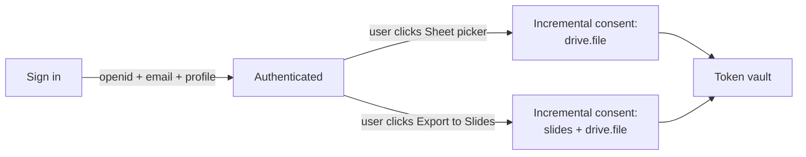
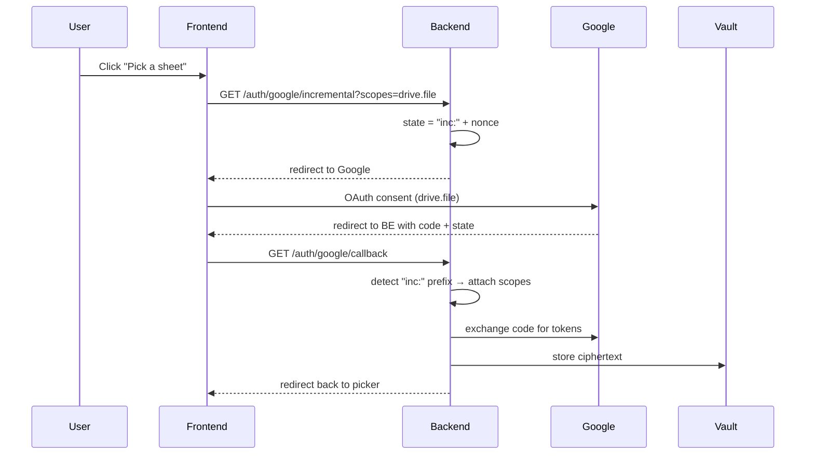
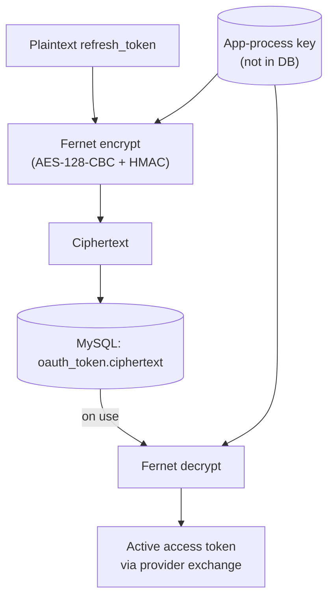
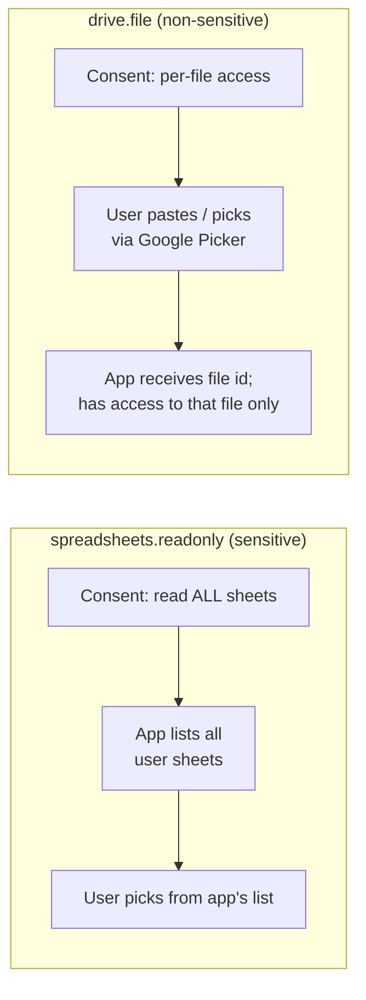
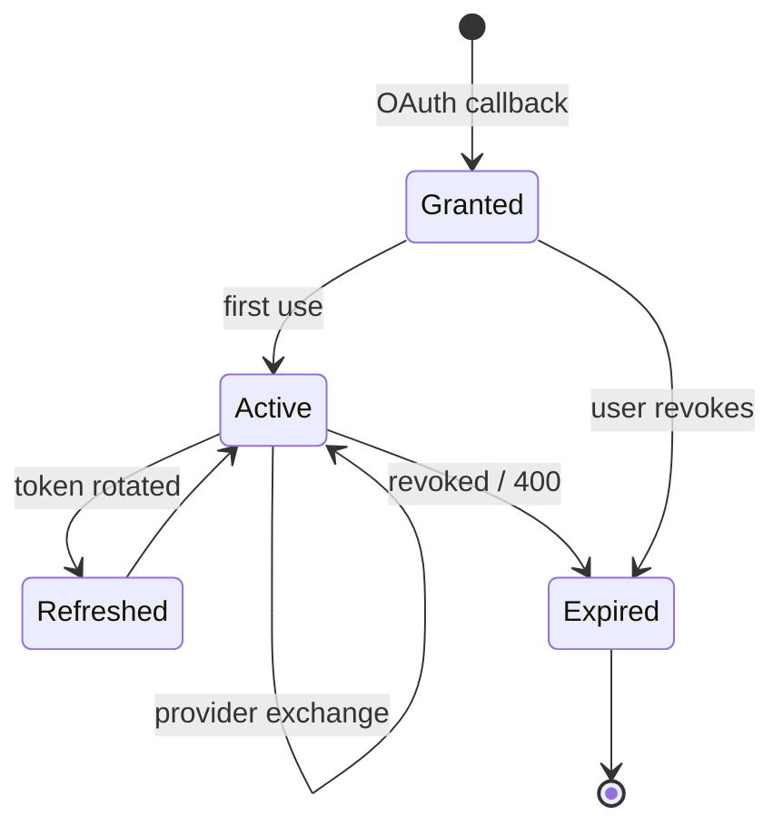
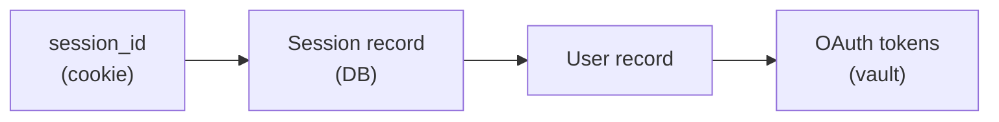

# 7. OAuth & Token Vault

Some flows require the user to authorize SlideMaker against an external
service — most commonly Google, for Google Drive (used by the scheduled
decks Google Sheets data source) and Google Slides export. This chapter
describes how that consent is obtained, how the resulting tokens are
stored, and why the chosen scopes are narrower than they could be.

## 7.1 Consent model: incremental, narrow scopes

A naive integration asks for every scope the application *might* need up
front. This is a verification hazard (broad scopes trigger Google's full
security review) and a user-experience hazard (a wall of consent toggles
on first sign-in).

The current model is the opposite:

Each feature triggers its own consent screen the first time it is used.
The scopes requested at each step are the minimum needed for *that*
feature. A user who never uses Sheets or Slides never authorizes those
scopes.

### 7.1.1 The `inc:` state prefix

To distinguish "fresh sign in" from "incremental consent for an already
signed-in user," the OAuth `state` parameter is prefixed with `inc:` for
incremental requests. The callback handler reads the prefix and routes
the response: a plain state value is a new sign-in (create / merge user,
issue session), while an `inc:` state value is a scope upgrade (attach
new scopes to the existing user, keep the session).

## 7.2 Token vault

Refresh tokens are long-lived secrets. If the database is exfiltrated, the
attacker can act as every user against every authorized provider for as
long as the tokens remain valid. To make that one-step compromise into a
two-step compromise, refresh tokens are encrypted at rest with a symmetric
key (Fernet) held only by the application process.

Properties:

- The encryption key is loaded into the application process at start
  time from an out-of-band source (environment, secrets manager).
- A leaked database backup alone does not yield usable tokens.
- The key can be rotated by decrypting with the old key, re-encrypting
  with the new key, and writing back. There is no token re-handshake
  required.

### 7.2.1 What is *not* encrypted

Access tokens (short-lived) are never stored. The vault holds refresh
tokens only; access tokens are fetched on demand by exchanging the
refresh token at the provider, used immediately, and discarded.

Scopes and metadata (`provider`, `scopes`, `granted_at`) are stored in
plaintext. They contain no secrets and are needed for routing decisions.

## 7.3 Why `drive.file` instead of `spreadsheets.readonly`

The scheduled decks Google Sheets integration originally asked for
`spreadsheets.readonly`. This is a **sensitive** scope under Google's
OAuth verification policy: it grants read access to every spreadsheet in
the user's Drive. To ship with that scope requires going through Google's
full security review, which is expensive in calendar time.

The replacement is `drive.file`, a **non-sensitive** scope that grants
the application access only to files the user *explicitly* picks via the
Google Picker UI. The user picks; the application gets a file id; the
application can read that file (and only that file) on subsequent runs.

### 7.3.1 The Picker quirk

`drive.file` can only *list* files that have been previously granted to
the application. A naive Picker integration shows an empty list to a new
user, because they have not yet granted access to anything. The workaround
is to use the Picker's `setFileIds` API to pre-navigate to a specific file
that the user provides by URL paste. The Picker treats this as a "grant
access to this file" confirmation, after which the file id flows to the
application normally.

This is more user-flow than a single "browse all sheets" picker, but it
keeps the integration in the non-sensitive band. The trade-off is
discussed in
[ADR-004](decisions/ADR-004-drive-file-and-picker.md).

## 7.4 Token lifecycle

The Active ↔ Refreshed loop is the common case. Expired (revoked by the
user, or marked invalid by the provider) terminates the token and
triggers a re-consent the next time the user invokes a feature that
needs the scope.

## 7.5 Session vs identity

A user identity (the row in the `USER` table) is decoupled from the
session token used by the browser. A single user can have multiple active
sessions (different devices); a single session belongs to exactly one
user.

Sessions are server-side records keyed by an opaque id stored in a
cookie. There is no JWT in this design; the choice was deliberate, to
keep revocation simple (delete the row) and to keep server-side state
authoritative.

## 7.6 Defense in depth

A short list of defensive measures applied above the basic encryption:

- **Scope minimization.** Every scope is justified per feature; broad
  scopes are not granted "in advance."
- **Per-feature consent.** Users see what each feature needs at the
  moment they use it.
- **No long-lived access tokens at rest.** Access tokens are never
  persisted; only the refresh token round-trips through the database.
- **Key separation.** The encryption key is loaded from a source the
  database does not have.
- **Auditable callback.** Every consent and every token issuance is
  logged (excluding ciphertext) with the user id, provider, scopes, and
  timestamp.

## 7.7 Connections to other chapters

- The Google Sheets / Drive flow is used by the scheduled decks data
  sources in [chapter 8](08-scheduled-decks.md).
- The scope-narrowing decision is in
  [ADR-004](decisions/ADR-004-drive-file-and-picker.md).
- The token table sits in the broader storage model in
  [chapter 6](06-storage-model.md).
