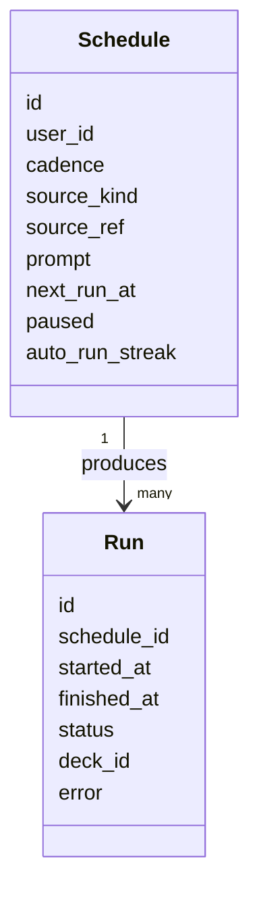
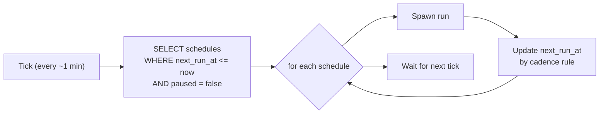
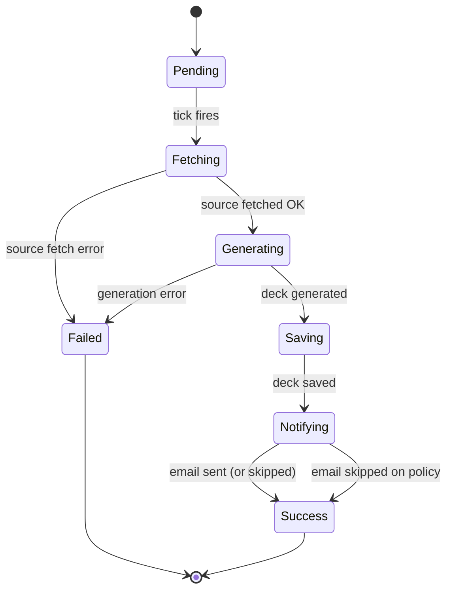
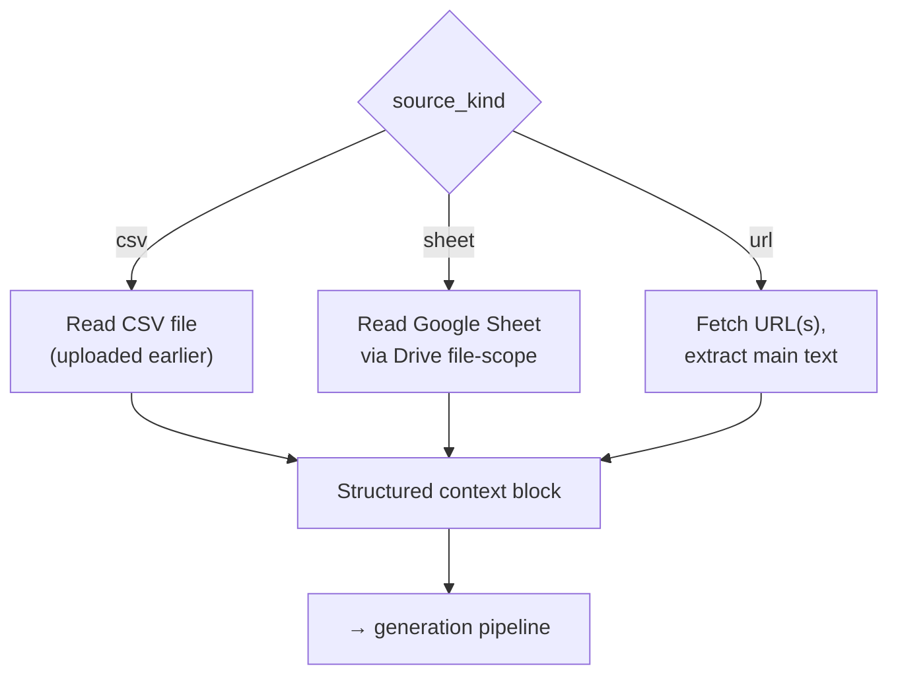
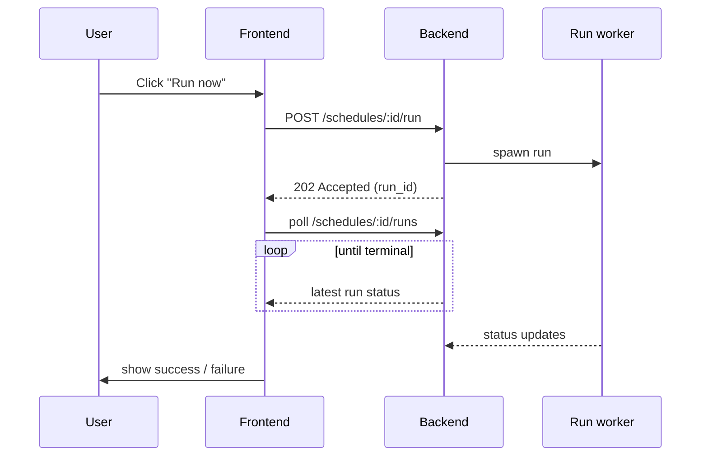
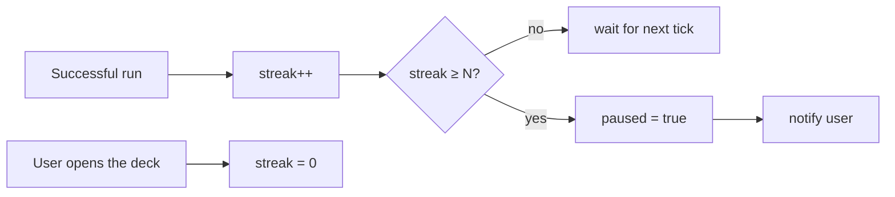

# 8. Scheduled Decks

A user can configure SlideMaker to generate a deck on a recurring schedule:
"every Monday at 9am, build a deck from this Google Sheet of last week's
metrics." This chapter describes the moving parts that make that work
without an external job queue.

## 8.1 What a schedule is

A schedule is a persistent specification with three parts:

1. **Cadence** — daily, weekly (with weekday), or monthly (with day-of-
   month). Plus a timezone-anchored time-of-day.
2. **Source** — what data feeds the generation. CSV upload, Google Sheet
   (file-scoped), or web URLs (up to a small number).
3. **Prompt** — the user's natural-language description of the deck the
   AI should make from the source data.

Each schedule has a `next_run_at` timestamp the system uses to decide when
to fire.

## 8.2 The tick

There is exactly one scheduler in the system: an in-process APScheduler
job that fires on a fixed interval (every few minutes). On each tick, it
scans for schedules whose `next_run_at` is in the past and processes
them.

The tick is intentionally short and idempotent: it claims a schedule for
this tick (so the next tick does not double-fire), recomputes
`next_run_at` to the *next* future occurrence, and then spawns the run
asynchronously.

### 8.2.1 Why in-process

External job queues (RQ, Celery, SQS) add an operational tier — a broker
to run, a worker fleet to scale, a dead-letter queue to monitor. The
scheduled-decks workload is small (a few thousand runs per day at the
upper bound) and not latency-sensitive (a minute of jitter is invisible).
APScheduler in-process is sufficient and avoids the extra moving parts.

Trade-offs are discussed in
[ADR-005](decisions/ADR-005-in-process-scheduler.md).

## 8.3 A run

A run is one execution of a schedule. It goes through five stages, four
of which are reused from the generation pipeline (chapter 2).

| Stage | What happens |
|-------|--------------|
| Fetching | The source connector reads CSV / Sheet / URL(s) and produces a structured context block. |
| Generating | The generation pipeline (chapter 2) runs with the user's prompt and the structured context. |
| Saving | The resulting deck is stored as a new deck under the user. |
| Notifying | A best-effort email tells the user the deck is ready (failure is logged but does not fail the run). |

Each run row records the status, the started/finished timestamps, and a
reference to the deck (on success) or an error message (on failure).

## 8.4 Data source connectors

Each connector implements the same interface: "given a source spec, fetch
and return a structured context block." The block is appended to the
generation prompt as a fenced section.

### 8.4.1 CSV connector

The user uploads a CSV during schedule creation. The file is stored once;
each run reads it. There is no per-run user interaction.

### 8.4.2 Sheet connector

The Sheet connector uses the file-scoped Drive access from
[chapter 7](07-oauth-and-token-vault.md). The schedule stores the sheet's
file id; each run reads the current contents at fire time, so the deck
reflects whatever the sheet says *that morning*.

If the refresh token has been revoked or the sheet has been deleted /
unshared, the run fails with a clear error and the schedule is paused
after enough consecutive failures (see § 8.6).

### 8.4.3 URL connector

A small number of URLs (up to three) can be attached to a schedule. The
URL fetcher uses a browser-like user agent, follows redirects, detects
Cloudflare challenges as failures (rather than treating the challenge
page as content), and extracts the main text via BeautifulSoup.

## 8.5 Run-now vs scheduled

Users can also trigger a run *immediately* — to test a schedule, or to
generate today's deck before tomorrow's tick. The same code path is used.
The difference is only in how it was triggered: a scheduled run is
spawned by the tick, a run-now is spawned by an HTTP request.

The HTTP response is 202 (Accepted) because the run is asynchronous; the
frontend polls the runs endpoint until the latest run has a terminal
status. This is simpler than a streaming progress channel and good
enough — runs take ~30 seconds at most.

## 8.6 Guardrails

A recurring AI workload can burn through tokens silently if something is
broken. Two guardrails keep that bounded:

### 8.6.1 Auto-pause on streak

Each schedule has an `auto_run_streak` counter that increments every time
a run *succeeds without user intervention*. When the streak hits a
threshold (e.g., 10), the schedule is paused with a clear message: "this
schedule has run 10 times in a row without you looking at the output;
confirm you still want it before we keep running."

This is not a failure guard — it is a *waste* guard. A schedule that
quietly produces decks the user never opens is consuming compute for no
value. The pause forces a manual confirmation.

### 8.6.2 Per-source row limit

The Sheet connector caps the number of rows it includes in the context
block. A user pointing a schedule at a million-row sheet would otherwise
produce a prompt larger than any LLM context window. The cap is enforced
at fetch time, and a warning is surfaced in the run record.

## 8.7 Why the same generation pipeline

Scheduled runs reuse the exact pipeline from chapter 2 — outline, expand,
layout, render. There is no "scheduled-mode" variant. This is deliberate:
a divergent pipeline would mean two places to fix bugs, two places to
tune prompts, and two places where output quality could drift.

The only thing the scheduled path skips is the SSE stream. Since there
is no live user watching, the run consumes the stream server-side, waits
for `done`, and saves the deck.

## 8.8 Connections to other chapters

- The generation pipeline reused here is chapter 2.
- The Google Drive file-scope used by the Sheet connector is chapter 7.
- The `SCHEDULE` and `RUN` tables are described in chapter 6.
- The scheduler-vs-queue trade-off is in
  [ADR-005](decisions/ADR-005-in-process-scheduler.md).
