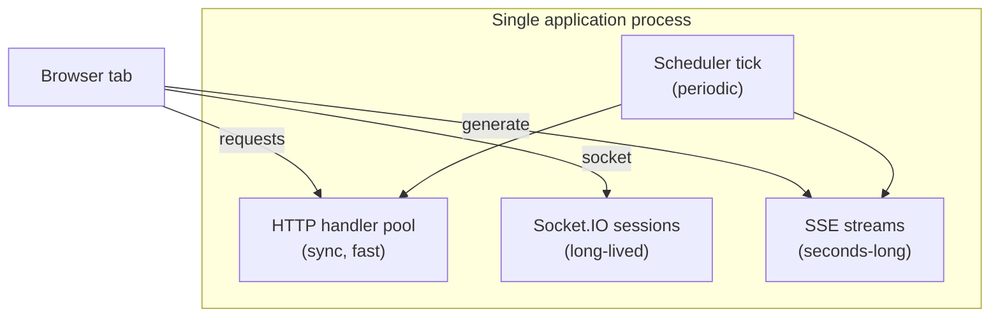
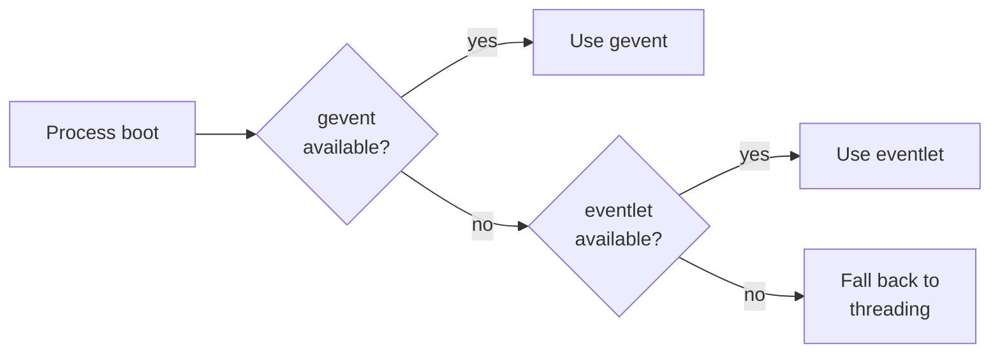
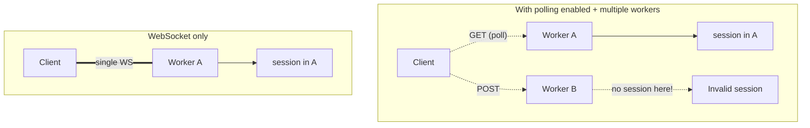
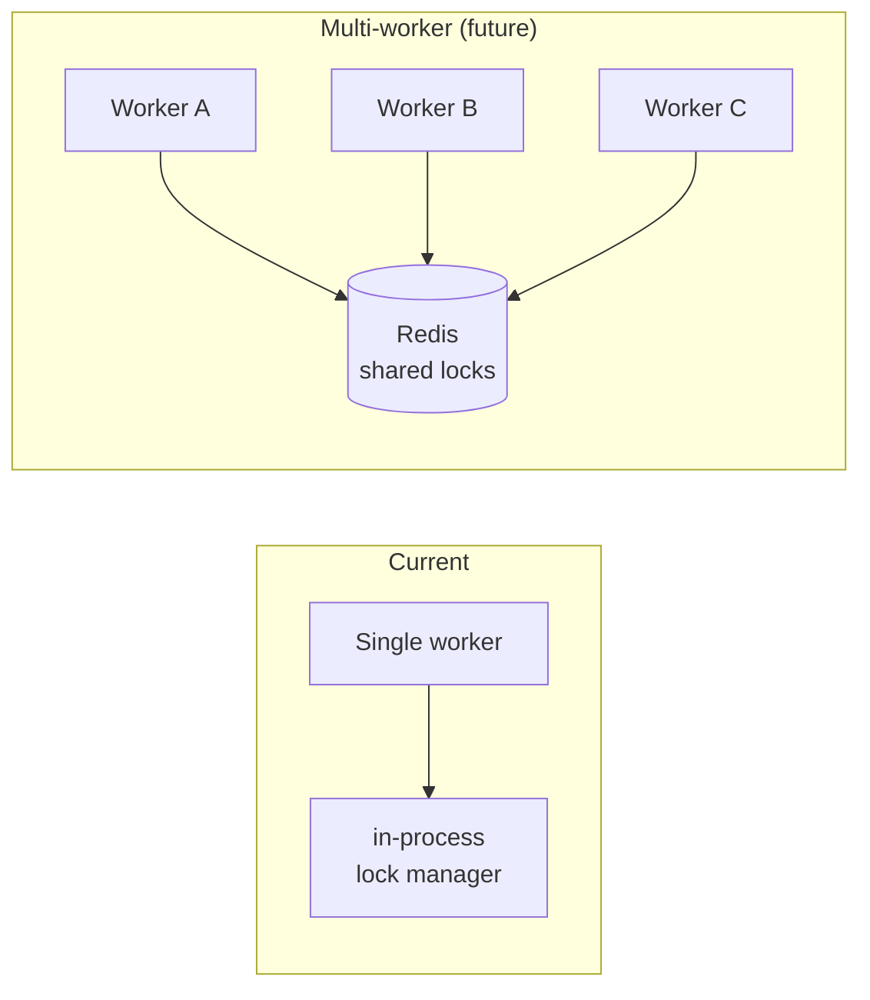
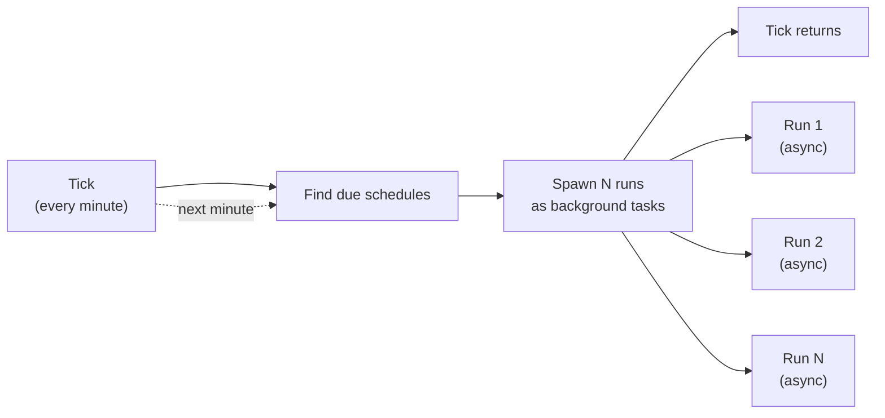

# 9. Concurrency Model

The application server hosts three concurrent workloads: synchronous HTTP
requests, long-lived Socket.IO sessions, and short-lived LLM streams. This
chapter explains how they share one process without starving each other,
and why a few unusual choices (WebSocket-only transport, single worker
for collab) hold.

## 9.1 The three workloads, side by side

Their resource profiles are different:

| Workload | CPU per request | Memory per request | Wall-clock per request | Concurrency at peak |
|----------|-----------------|--------------------|------------------------|---------------------|
| HTTP | low | low | 50–200 ms | hundreds |
| Socket.IO session | very low | tiny | minutes to hours | thousands of idle, dozens active |
| SSE stream | low | low | seconds to ~1 min | dozens at peak |
| Scheduler tick | low | low | seconds | a handful concurrent runs |

The dominant scaling constraint is *socket count*, not CPU. A worker
holding ten thousand mostly-idle sockets uses far less CPU than a worker
serving a thousand HTTP requests per second.

## 9.2 Async server framework

The server uses Flask-SocketIO. It auto-detects the available async
runtime in the following preference order:

In production the runtime is gevent. Sockets are cheap "green threads,"
which is what makes thousands of idle sessions viable in a single process.

## 9.3 The transport choice: WebSocket only

Socket.IO supports two transports: long polling and WebSocket. The server
is configured to allow **only WebSocket**. The reason is a subtle
multi-worker concern, made visible by a real-world incident:

When polling is allowed, the GET and POST halves of a poll cycle can be
served by different workers. Each worker maintains its own session map,
so the second worker has no record of the session created by the first
and returns "Invalid session." There are workarounds (session affinity,
shared session store), but the simplest fix is to forbid polling.

The cost is that the server is unreachable from environments that block
WebSockets (some corporate networks). For the user base, this is an
acceptable trade-off; for an enterprise rollout, it would not be, and
the right answer would be a shared session store.

The decision is recorded in
[ADR-001](decisions/ADR-001-websocket-only-transport.md).

## 9.4 Why a single worker for collaboration

Locks (chapter 3) live in process memory. Two workers would each have
their own lock table and would happily grant the same lock to two
clients. Solving this requires either:

- **Sticky sessions** — route every client of a given room to the same
  worker. Doable, but every layer in front of the application (proxy,
  CDN) has to cooperate.
- **Shared lock store** — Redis or similar, accessed by every worker.
  Adds an operational tier and a network hop on every lock operation.

Neither is worth the complexity until traffic forces it. A single worker
with gevent green threads handles thousands of idle sessions and dozens
of active rooms comfortably.

The migration path is well-understood; the cost is real but bounded.

## 9.5 SSE streams and the request slot

An SSE stream holds the request slot for as long as the stream runs —
typically 20–60 seconds. With gevent this is essentially free (the slot
is a green thread, not a thread), but two limits still apply:

1. **Max connections per origin** in browsers. A user with two tabs
   running generation in the same origin will hit the browser's
   per-origin connection limit (six in most browsers) faster than they
   would with shorter requests. In practice this is not a real
   constraint at SlideMaker's scale.
2. **Proxy buffer behavior.** Some proxies buffer responses before
   flushing to the client. Buffering breaks SSE: the events never
   reach the browser until the server closes the stream. The edge
   proxy is configured to *not* buffer SSE responses; this is the
   single most fragile bit of the streaming setup and is checked
   in deploy smoke tests.

## 9.6 Scheduler tick concurrency

The scheduler tick runs on its own scheduled job inside the same process.
At fire time it queries due schedules, then *spawns* runs as background
tasks; the tick itself returns quickly so the next tick is not delayed.

Each run is itself bounded in concurrency at the LLM-call layer (chapter
2), so a burst of due schedules does not produce a thundering herd at
the LLM provider.

## 9.7 Shared mutable state inside the process

The process holds several pieces of in-memory state shared across green
threads:

| State | Owner | Lifetime |
|-------|-------|----------|
| Socket.IO session map | framework | process |
| Room registry (chapter 3) | collaboration module | process |
| Lock table | lock manager | process |
| Generation cache (input hash → cached output) | pipeline | process |
| Awareness state | collaboration module | per session |

All access to these structures is single-threaded by virtue of the green
thread model: there is no preemptive thread that can yield control
inside a non-yielding section. The disciplined rule is "do not perform
network I/O while holding an invariant"; in practice the modules are
small and easy to inspect.

## 9.8 Where the model would break

Worth being honest about the failure modes:

- **A second worker, naïvely added.** Two workers with in-memory locks
  hands out duplicate locks. The system would not crash; it would just
  produce silent collaboration bugs.
- **Polling re-enabled.** "Invalid session" errors for half of all
  socket events.
- **Edge proxy buffering enabled by default.** Streaming generation
  appears to hang for 30 seconds and deliver all slides at once.
- **A blocking call sneaking into a green thread.** A `time.sleep()` or
  a CPU-heavy hash on the request path would freeze every other green
  thread in the worker.

Each is preventable and visible to operators, but none are caught by
type checking — they require operational care.

## 9.9 Connections to other chapters

- The collaboration model that depends on in-process locks is chapter 3.
- The SSE protocol carried over the request slot is chapter 4.
- The scheduler tick spawning concurrent runs is chapter 8.
- The transport choice ADR is
  [ADR-001](decisions/ADR-001-websocket-only-transport.md).
