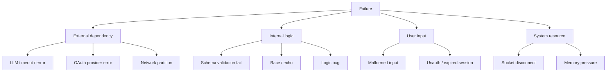
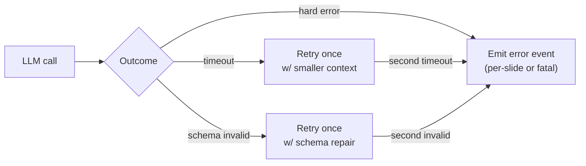
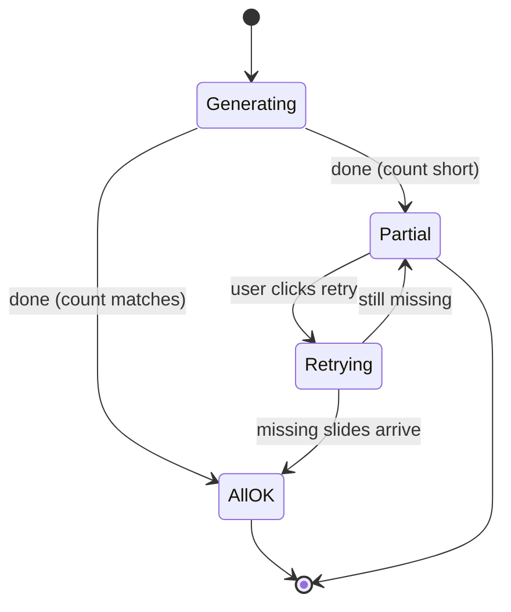
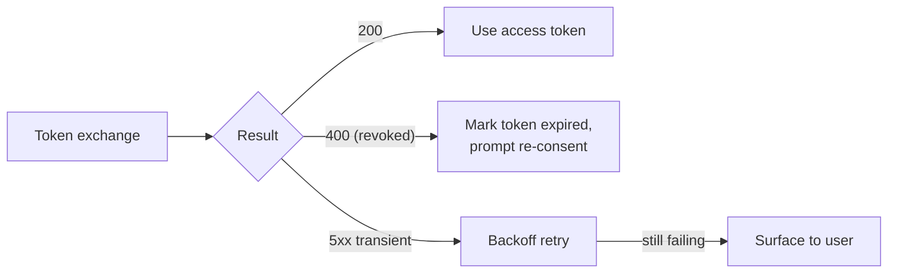
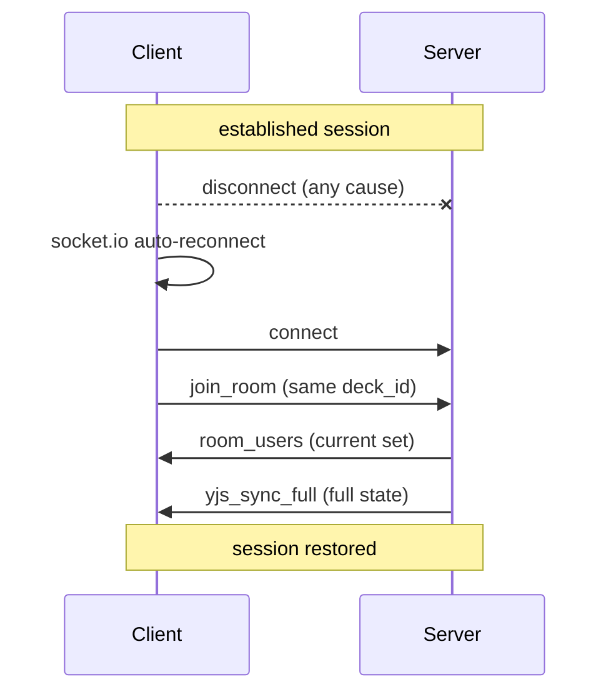
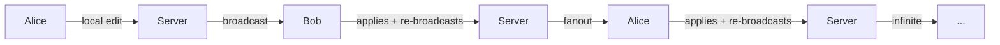
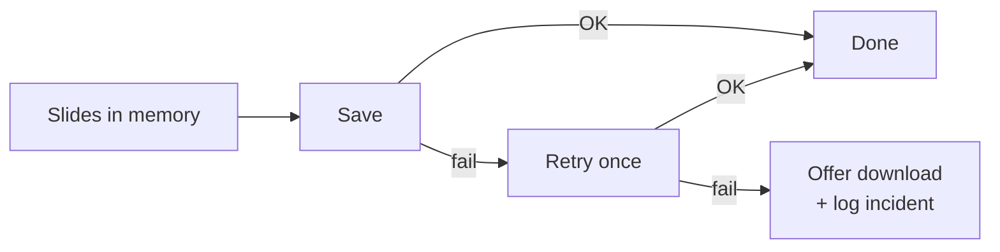

# 10. Failure Modes

A production system is only as honest as its failure handling. This
chapter enumerates the failure classes the system actually experiences,
how they manifest, and what the recovery path is.

## 10.1 Taxonomy

Each class has different visibility, different blast radius, and different
recovery semantics. The sections below pick the most interesting from
each branch.

## 10.2 LLM failures

The single most common external failure. Three subtypes:

- **Timeout.** The per-call timeout (chapter 4) bounds wait. On expiry,
  the call is retried once with a shorter input (compressed context).
  A second timeout escalates to an error event for the affected slide.
- **Schema invalid.** A targeted retry includes the schema and the bad
  output in the next system message. This catches almost all formatting
  mistakes.
- **Hard error.** Provider 4xx/5xx, or a malformed response that retries
  cannot fix. The pipeline emits a per-slide error and continues; if the
  outline call fails this way, the entire run aborts with `error fatal`.

## 10.3 Partial generation

A 10-slide run that finishes with 8 slides is a partial success. The
client sees `done` with `slide_count: 8` and renders the deck with two
slots marked failed. The user is offered a per-slide "retry" affordance
that re-runs the expansion for just those slides without re-running the
outline.

The deck is saved either way. A partial deck with two missing slides is
strictly better than no deck at all.

## 10.4 OAuth provider failures

Three subtypes:

- **Refresh token revoked.** User changed their password, or revoked
  access from the provider's settings. The next exchange returns 400.
  The token row is marked expired; the feature that triggered the call
  prompts the user to re-consent.
- **Scope downgrade.** User re-consented but unchecked a scope. The
  attached scopes are updated to match the new grant; features requiring
  the missing scope prompt for re-consent on next use.
- **Provider transient error.** 5xx from the provider. The call is
  retried with backoff up to a small bound, then surfaces as an error
  to the user.

## 10.5 Socket disconnects during collaboration

A collaboration session can drop for any of: network blip, laptop sleep,
mobile tab eviction, server restart. The recovery flow is the same in all
cases.

Locks held by the disconnected session are *not* immediately released.
They expire when the lock manager notices the missing heartbeat (chapter
3). This is intentional: a brief disconnect should not let another user
swoop in mid-edit.

If the server itself restarts, all in-memory state is gone. Every client
reconnects, every room rebuilds, every lock is briefly free. The
user-visible artifact is a half-second of "stale data" before the
`yjs_sync_full` arrives.

## 10.6 The echo loop

A class of bug particular to bidirectional sync: a remote update is
applied locally; the local change subscription detects "a slide changed"
and broadcasts it back to the server; the server fans it out to every
other client (including the original sender); they apply it as a remote
update and re-broadcast it; ad infinitum.

The guard (chapter 3) is a pair of flags suppressing the re-broadcast for
a short window after a remote update is applied. The historical failure
mode — StrictMode double-mount creating two independent guards that did
not see each other's flag — is the subject of
[case-studies/echo-loop.md](case-studies/echo-loop.md).

## 10.7 Stale identity in collab rooms

If a user opens the editor while signed out and signs in moments later,
the collab session must rejoin with the new identity. Otherwise the
server has them as `anonymous` and refuses subsequent owner-only
operations.

The fix is to re-key the auto-join effect on the user identity, not just
on the deck id. A late login triggers a re-join with the real user id.
The case study
[late-login-anonymous-id.md](case-studies/late-login-anonymous-id.md)
walks through the symptoms.

## 10.8 Database write failures during a run

The save stage at the end of a generation run is the last place where
the run can fail. If the database write fails:

- The slides exist in memory and have been emitted to the client.
- The deck row was not created (or partially created).

Recovery is to retry the save with the same payload. The run row records
the failure and the retry; if the retry also fails, the user sees an
error and the deck content is offered as a download (so the work is not
lost while the database issue is investigated).

## 10.9 Recovery hierarchy

A useful one-line summary of the recovery policy:

> Prefer **automatic per-step retry** for transient errors,
> **graceful degradation** for partial failure,
> **user-visible escalation** with a clear next action for everything
> else.

What the system *does not* do:

- Silent retries that mask root causes.
- Best-effort error swallowing.
- Surfacing raw exception text to users.

## 10.10 Connections to other chapters

- Each chapter's "what happens on failure" sections feed into this one.
- The post-mortems in `case-studies/` are concrete instances of failures
  the system has lived through.
