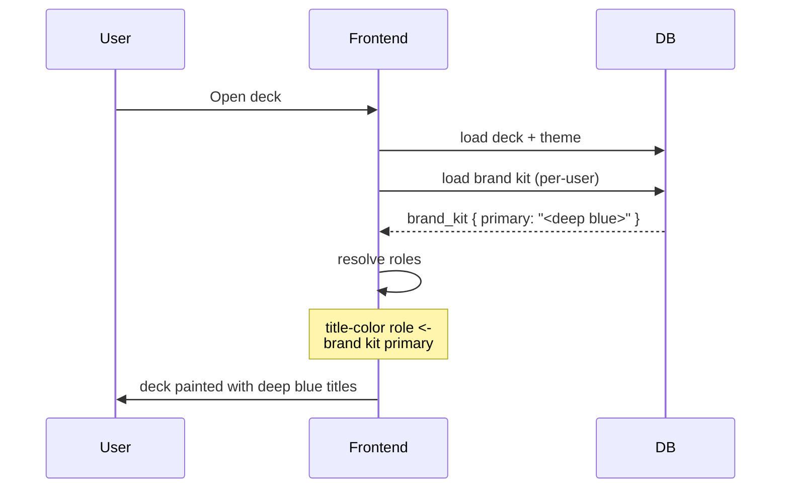

# Case Study — The brand kit color that ate every title

A bug visible only to a specific user, on every deck they opened, on
every theme. The user thought their account was broken. The actual
cause was a single innocuous row in the database.

## Symptoms

A user reported that every deck they opened — including newly generated
decks on a variety of themes — had a deep blue title, regardless of the
theme's design. Other users opening the same decks saw the theme's
intended title color. Switching themes did not help; nothing the user
clicked in the editor changed it.

The reported color was a specific RGB value (deep saturated blue), which
the user did not remember ever setting.

## Failing flow

A long-forgotten brand kit row in the database held the user's brand
kit primary color as a deep blue. The frontend dutifully applied it as
the title role color, overriding the theme.

## Initial theories (all wrong)

1. **Theme registry corruption.** Inspected the theme; defaults were
   correct.
2. **A recent generation bug baking literal colors into slide elements.**
   Inspected slide rows; element colors used roles, not literals.
3. **Browser style cache.** Hard reload showed no change.

All three theories assumed the bug was in code. The bug was in user
data.

## How it was found

A DB query for the user's brand kit row showed a `primary_color` of the
deep blue RGB the user reported, with `is_active = 1`. The user had set
this color months earlier, forgotten about it, and the brand kit
override layer (chapter 5) was working exactly as designed.

## Was this a bug?

Yes, and no:

- **Yes,** because "I set my brand primary to blue" should not silently
  recolor every title on every theme. That is unexpected.
- **No,** because the resolver was doing exactly what the design said:
  brand kit overrides theme.

The real bug was in the *role mapping*: the brand kit's `primary_color`
mapped to the title-color role, when most users expect "primary" to
mean accent / brand-mark / call-to-action — not the color of every
heading.

## Fix

Two layered changes:

1. **Role refinement.** Brand kit `primary_color` was decoupled from
   title-color. Title color now defaults to the theme's display color
   unless the brand kit *explicitly* sets a `title_color` field
   (currently exposed only to advanced users).
2. **Visibility.** The brand kit editor now previews the effect of each
   override on a sample slide before saving, so users can see "this
   will color all your titles" before committing.

## Lessons

1. **Data can have a louder voice than code.** A bug-free system can
   produce buggy output if the data tells it to.
2. **"Primary color" is overloaded.** Users hear "brand mark"; design
   systems hear "main palette stop." A role-based resolver only works
   when the roles are named precisely.
3. **Visible previews change risk class.** A change that visibly
   previews its consequences before saving has a far smaller blast
   radius than the same change applied invisibly.

## See also

- Chapter 5 — Theme and brand kit (resolver design).
- Chapter 6 — Storage model (brand kit row).
