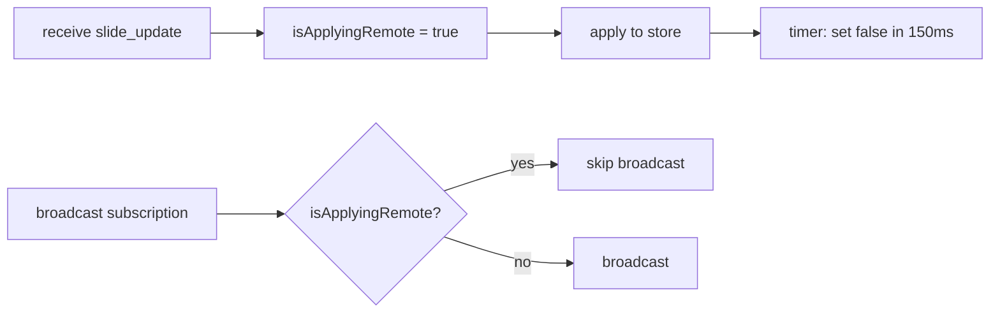
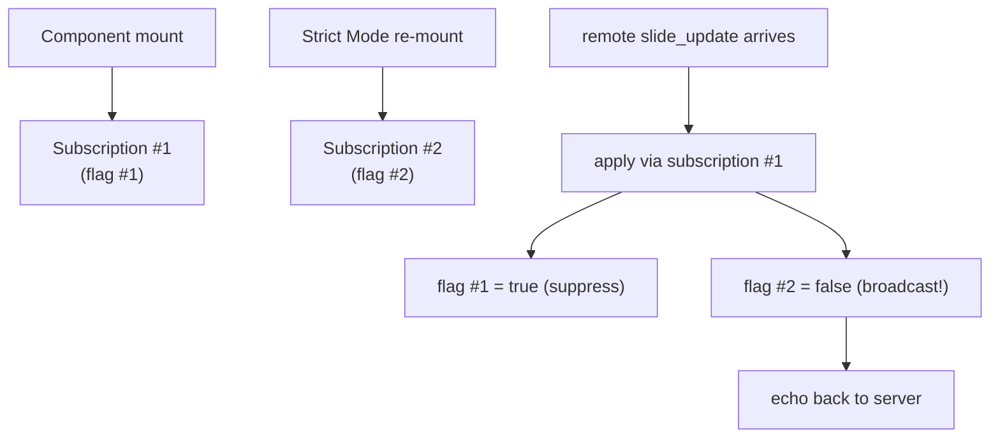
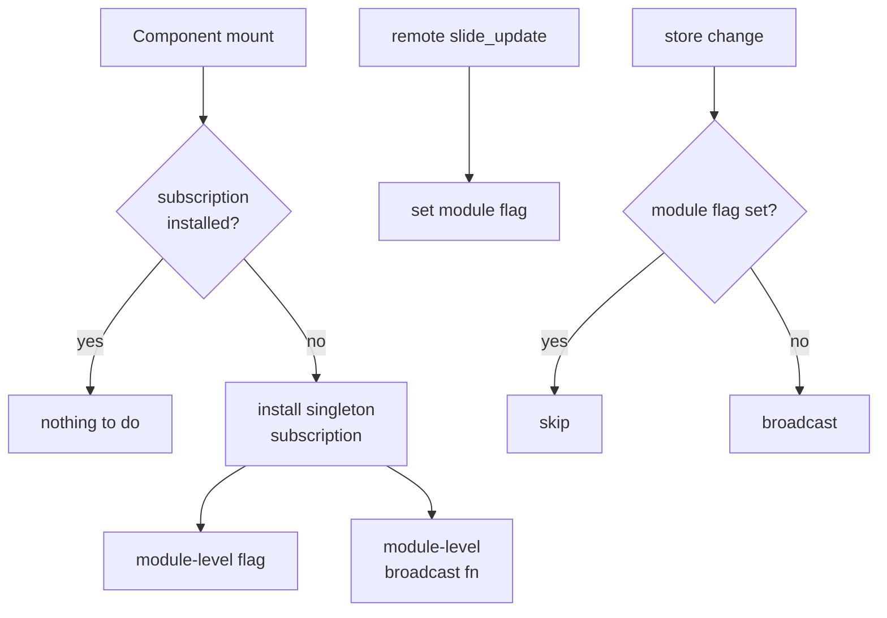

# Case Study — The infinite echo loop in collaborative editing

A bug that survived two attempted fixes and lived in production for
several days before being properly understood. The instructive part is
that each "fix" addressed the surface symptom but missed the structural
cause.

## Symptoms

A user reported that opening a deck in two tabs (testing collaboration as
a single user) caused both tabs to flood the server with `slide_update`
events. Network panel showed thousands of events per second. CPU on the
client went to 100%. On a real two-user collaboration, the same flood
happened but harder to reproduce because both tabs needed to be active.

## Failing flow

```mermaid
sequenceDiagram
    participant A as Tab A
    participant S as Server
    participant B as Tab B

    A->>S: slide_update (edit X)
    S->>B: slide_update (edit X)
    B->>B: apply edit X
    B->>S: slide_update (echo of X)
    S->>A: slide_update (echo of X)
    A->>A: apply echo
    A->>S: slide_update (echo of echo)
    Note over A,B,S: forever
```

A local store change in tab B (caused by applying X) was indistinguish-
able from a user edit, so the broadcast subscription happily forwarded
it back to the server.

## Attempted fix 1 — the guard flag

The first fix added an `isApplyingRemote` flag inside the
`useCollaborationSync` hook. Set it to true before applying a remote
update; set it to false after; the broadcast subscription checks the
flag and skips re-broadcasting while it is true.



This worked in development. In production, the bug persisted.

## Attempted fix 2 — instance flag becomes module-scope flag

Speculation that there might be multiple subscriptions racing led to
hoisting the flag to module scope. Same behavior. The bug still repro-
duced under specific conditions.

## Root cause — React StrictMode double-mount

React 19's Strict Mode intentionally double-invokes effects in
development to surface bugs. The `useCollaborationSync` hook was being
mounted, unmounted, and re-mounted on first render. Each mount installed
*its own* store subscription. Each subscription had *its own* ref-scoped
flag.



The "fixed" version had two parallel subscriptions. One saw the apply
event and set *its own* flag to suppress the echo. The other saw the
same apply event as a store change and broadcast it, because it had
never seen the flag set.

The echo loop was not between Alice and Bob. It was between Subscription
#1 and Subscription #2 inside a single tab.

## Real fix

Hoist *both* the subscription and the flag to module scope. There is
now exactly one subscription per page, regardless of how many times the
hook mounts.



Module-level state survives component re-mounts. The flag set by the
"apply remote" path is the same flag the broadcast path reads.

## Lessons

1. **Strict Mode is not a development-only quirk.** Code that does
   non-trivial side effects on mount must be safe under double-invoke.
2. **`useRef` is per-mount.** A ref hoisted to a hook does not survive
   re-mount, regardless of how convenient it looks for "module state."
3. **When a guard does not work, suspect parallel guards.** The system
   does not get *more* careful by having two of something; it gets less
   careful, because each instance assumes it has full visibility.

## See also

- Chapter 3 — Real-time collaboration (current echo-loop guard design).
- Chapter 10 — Failure modes (the echo loop class).
