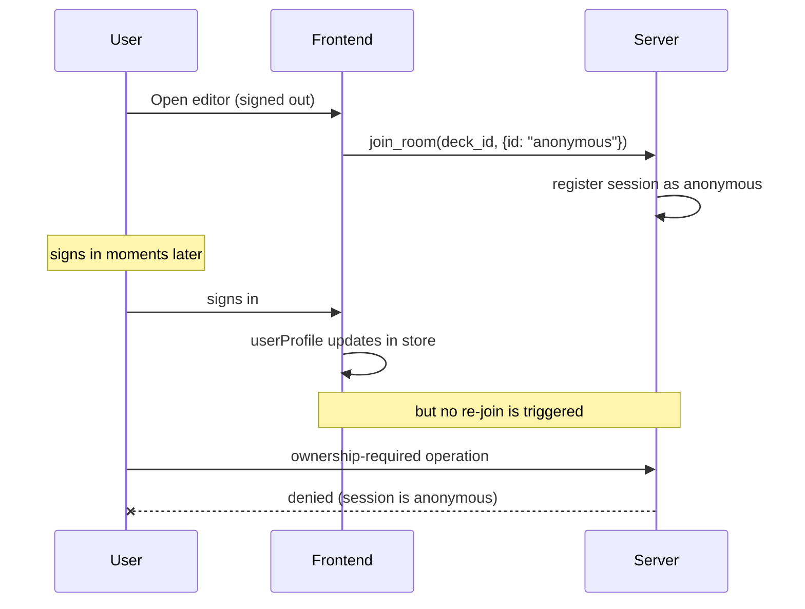
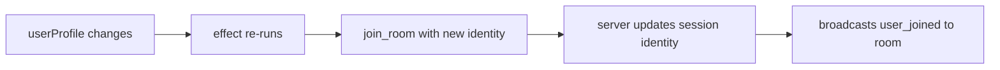

# Case Study — Late login leaking anonymous identity into collab rooms

A bug that affected the *owner* of a deck more than guests. The
collaboration server treated the owner as anonymous; the owner's
identity propagation needed a re-key on identity change.

## Symptoms

Users reported two confusing behaviors:

- Opening their own deck while signed out, then signing in moments later,
  resulted in the deck owner being shown to other collaborators as
  "Guest" even after the sign-in.
- Server-side operations gated on ownership (e.g., publish, change
  share settings) were being denied for the owner from the editor tab.

The bug was intermittent because users who opened the editor *after*
already being signed in were unaffected.

## Failing flow



The frontend stored the user identity in a Zustand slot. The auto-join
effect read that slot once and called `connectAndJoin` with whatever it
saw at that moment. When the user signed in later, the effect did not
re-run, so the server's view of the session stayed "anonymous."

## Root cause

The auto-join effect was keyed only on the deck id:

```text
useEffect(() => { collab.connectAndJoin(user, slideId); }, [slideId]);
```

This effect runs once per deck change. A user identity change is *not*
a deck change, so the effect did not re-fire, and the server kept the
session it was originally given.

## Real fix

Re-key the auto-join effect on a stable representation of the user id
in addition to the deck id. When the user id changes (sign-in,
sign-out, account switch), the effect re-runs and re-joins the room
with the new identity.



Two additional refinements were needed:

1. **Latest identity, not stale closure.** The `connectAndJoin` function
   had been written to use the local user captured on first connect.
   When called from a re-join after sign-in, it must use the *fresh*
   identity passed in, not the stale local copy. The function now
   accepts the identity as an argument and overwrites the local copy.
2. **Idempotent rejoin guard.** A naive re-join on every render storm
   would flood the server. The effect remembers the last `(deck, user)`
   pair it joined for, and skips if both are unchanged.

## Why the rest of the room sees the wrong name

The collaboration server broadcasts a `user_joined` event with the
identity it has for the session. Until the re-join fires, that identity
is still "Guest". Re-joining after sign-in produces a fresh
`user_joined` with the real name, which other clients render as a
relabel of the same color.

## Lessons

1. **Identity is a join key, not an attribute.** Treat it like deck id:
   when it changes, re-join.
2. **Effect dependency arrays are commitments.** Anything the effect
   *reads* must be in the array, even if you "know" it does not change
   often. The exception is intentional; document it.
3. **Server-side authoritative checks expose client-side identity
   bugs.** If the server hadn't rejected the ownership-required
   operation, the bug would have shipped unnoticed.

## See also

- Chapter 3 — Real-time collaboration.
- Chapter 7 — OAuth & sessions.
