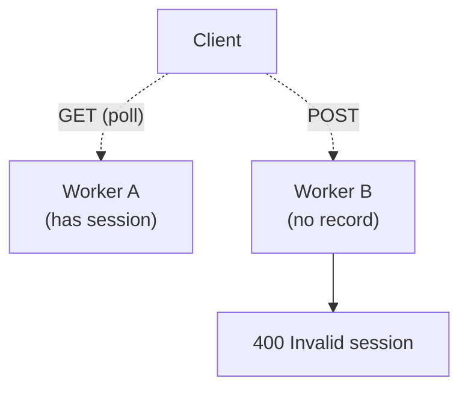

# ADR-001 — WebSocket-only transport for Socket.IO

**Status:** Accepted
**Date:** 2025
**Context chapter:** [9. Concurrency model](../09-concurrency-model.md)

## Context

Socket.IO supports two client transports: long polling (HTTP) and
WebSocket. By default a client tries WebSocket first and falls back to
long polling if the upgrade fails (e.g., in an environment that blocks
WebSockets).

The application originally had a multi-worker deployment with polling
enabled. Symptoms appeared as intermittent "Invalid session" errors on
the client, scaling roughly with concurrent traffic.

## Cause

Long polling is implemented as alternating GET (server → client) and POST
(client → server) HTTP requests. With multiple gunicorn workers and no
session affinity, the two halves of a poll cycle are served by different
workers. Each worker maintains its own in-memory session map, so the
second worker has no record of the session created by the first and
returns "Invalid session."

## Decision

Configure the Socket.IO server to accept only the `websocket` transport.
The client is forced to upgrade; if the upgrade fails, the client is
disconnected.

## Alternatives considered

| Option | Pros | Cons | Rejected because |
|--------|------|------|------------------|
| Sticky sessions at the proxy | Keeps polling fallback | Every layer (proxy, CDN) must cooperate | Operational complexity not worth recovering polling |
| Shared session store (Redis) | Polling works across workers | Adds a runtime dependency for every socket op | Same complexity issue, plus a hop on every event |
| Single worker, polling allowed | Simple | Caps concurrency to one process | Restricts horizontal scale for the wrong reason |
| **WebSocket only (chosen)** | Simple; sessions stay on a single worker by design | Unreachable from networks that block WebSockets | Acceptable for the current user base |

## Consequences

- Users on networks that block WebSocket (some corporate proxies) cannot
  use the collaboration feature.
- The collaboration server is implicitly single-worker. Multi-worker
  collaboration would require revisiting this decision *and* moving lock
  state to a shared store.
- No fallback for misbehaving WebSocket-capable proxies. The edge proxy
  must be configured to pass WebSocket upgrades without buffering.

## Revisit when

- Enterprise rollout where blocked-WebSocket environments matter.
- Multi-worker collaboration becomes necessary for capacity.
