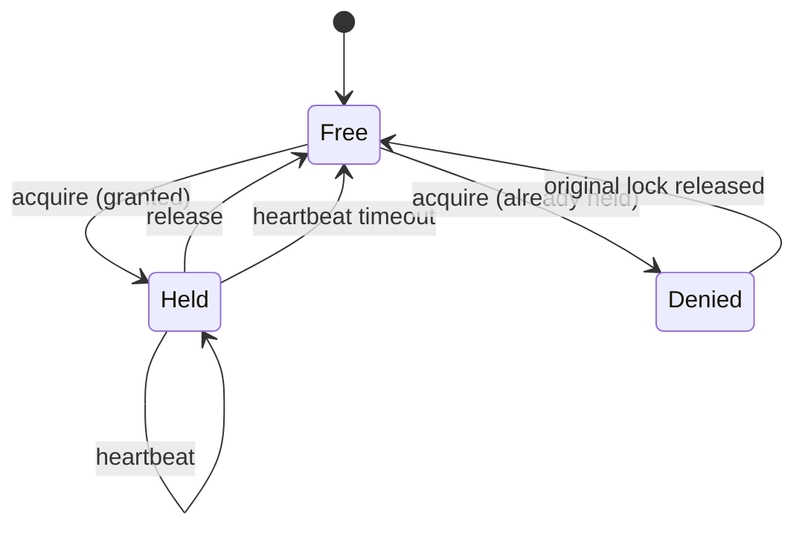

# ADR-003 — Pessimistic locks for non-text elements

**Status:** Accepted
**Date:** 2025
**Context chapter:** [3. Collaboration](../03-collaboration.md)

## Context

Yjs ([ADR-002](ADR-002-yjs-over-ot.md)) merges concurrent text edits well.
It does not merge concurrent *position* or *data* edits well: when two
users drag the same rectangle in different directions, the "merge" is
visually wrong no matter which way the CRDT resolves it.

The system needs a different model for non-text elements.

## Decision

A non-text element edit follows a pessimistic protocol:

1. The client acquires a lock when the user focuses the element.
2. The server grants the lock if the element is free; denies it
   otherwise.
3. The client may mutate the element while holding the lock; mutations
   are broadcast to other clients as `slide_update` events.
4. Other clients see a "locked by X" overlay on that element while the
   lock is held.
5. The client heartbeats while the lock is held; missing heartbeats
   expire the lock.
6. The client releases the lock on blur or unmount.

## Alternatives considered

| Option | Pros | Cons | Rejected because |
|--------|------|------|------------------|
| Custom OT for elements | Theoretical merge for all edits | Months of engineering; brittle for non-trivial element kinds (charts, tables) | Cost too high for the benefit |
| Optimistic edits, server resolves | Snappy UX | Visible "your move undone" rollbacks; ugly | UX worse than waiting for a lock |
| Allow concurrent edits, last-write-wins | Trivial | Silent data loss | Unacceptable |
| **Pessimistic per-element lock (chosen)** | Simple, predictable, no rollbacks | Brief wait for other users mid-edit | Best UX/effort trade-off |

## Consequences

- Lock state lives in process memory on the server. Single-worker only
  (see [ADR-001](ADR-001-websocket-only-transport.md) and chapter 9).
- A disconnected client's lock takes a few seconds to expire (the
  heartbeat window). This is felt as a "stuck lock" by other users in
  the room.
- The model does not cover *concurrent insertion* of new elements. Two
  users adding a new shape at the same time succeed independently; the
  result is two new shapes, not a merge conflict. This is the right
  behavior.

## Granularity choice

The lock is *per element*, not per slide. A user editing a chart on
slide 7 does not block another user from moving a shape on the same
slide. Per-slide locks were tried briefly and felt overly coarse.

## Revisit when

- A shared lock store is needed to support multi-worker collaboration.
- An element kind appears where pessimistic locking visibly degrades UX
  (e.g., a freehand drawing surface).
