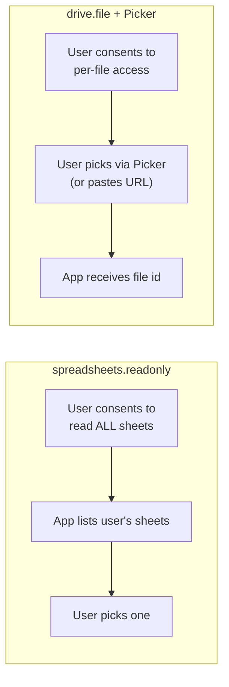

# ADR-004 — `drive.file` + Google Picker over `spreadsheets.readonly`

**Status:** Accepted
**Date:** 2025
**Context chapter:** [7. OAuth & token vault](../07-oauth-and-token-vault.md)

## Context

The scheduled-decks Google Sheets data source needs to read a single
spreadsheet on a recurring schedule. The intuitive scope is
`https://www.googleapis.com/auth/spreadsheets.readonly`, which grants
read access to every spreadsheet in the user's Drive.

Google classifies `spreadsheets.readonly` as a **sensitive** scope. An
application that requests it must pass Google's verification process,
including a security review. Verification is calendar-time expensive
(weeks to months) and friction-heavy for a small team.

## Decision

Use `https://www.googleapis.com/auth/drive.file` instead, combined with
the Google Picker UI for file selection. `drive.file` is a
**non-sensitive** scope; it grants the application access only to files
the user explicitly picks via Picker (or files the application creates).

## Alternatives considered

| Option | Pros | Cons | Rejected because |
|--------|------|------|------------------|
| `spreadsheets.readonly` | Single consent, no Picker UI | Sensitive scope → full Google verification | Verification cost too high |
| Service account + per-file share | No user consent for the *app* | User must manually share each sheet with a service account email; confusing UX | Bad UX |
| Export sheet to CSV upload | No OAuth at all | Defeats the "live data" value of a recurring schedule | Wrong feature |
| **drive.file + Picker (chosen)** | Non-sensitive scope, per-file consent surfaces the privacy model | Picker has a quirk: it can only list previously-granted files | Best trade-off |

## The Picker quirk and the workaround

`drive.file` only permits the Picker to list files the application
*already* has access to. For a new user, that list is empty — the Picker
appears to show no spreadsheets at all, which is a confusing UX.

Workaround: collect the sheet's URL from the user via a paste field,
then call `setFileIds([sheetId])` on the Picker. The Picker now pre-
navigates to that specific file; selecting it grants access. Subsequent
runs read the file by id without further user interaction.

## Consequences

- A schedule that references a Google Sheet requires the user to confirm
  *that specific sheet* once. Subsequent runs are silent.
- The flow is two steps (paste URL → confirm in Picker) instead of one
  (browse and pick), but it stays in the non-sensitive scope band.
- No Google security review is required for shipping this feature.
- If the user later un-shares the sheet, runs fail cleanly and the
  schedule auto-pauses after enough consecutive failures.

## Revisit when

- The team is willing to invest in Google's verification process and
  unlocks the broader-scope UX.
- Google relaxes Picker's `drive.file` constraints (unlikely).
