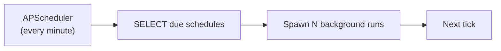

# ADR-005 — In-process scheduler tick

**Status:** Accepted
**Date:** 2026
**Context chapter:** [8. Scheduled decks](../08-scheduled-decks.md)

## Context

Scheduled decks need a recurring "fire at the right time" mechanism. The
common production choices are:

1. **External queue + worker fleet.** Producer enqueues a job at the
   target time (or uses a delay queue); workers consume.
2. **External cron service** (system cron, managed scheduler) that hits
   an HTTP endpoint at scheduled times.
3. **In-process scheduler** (APScheduler, BackgroundScheduler) running
   inside the existing application.

## Decision

Use an in-process APScheduler tick that wakes every minute, scans the
`SCHEDULE` table for due rows, and spawns runs as background tasks.

## Alternatives considered

| Option | Pros | Cons | Rejected because |
|--------|------|------|------------------|
| Celery + Redis / RQ | Battle-tested; supports retries, dead letters, large fleets | Adds a broker + worker tier to operate, monitor, and back up | Operational cost outweighs the benefit at this volume |
| Managed scheduler hitting an HTTP endpoint | No new process to run | Adds an external dependency for a feature that lives entirely in our app; auth on the endpoint becomes a concern | More moving parts than necessary |
| System cron + script | Trivial | The cron environment is not the application environment; reusing code requires shipping a CLI entry point and managing its dependencies | Operationally clumsy |
| **In-process APScheduler (chosen)** | Zero extra infra; uses the same code paths as live generation | Tightly coupled to the single application origin | Right size for the workload |

## Why "every minute" granularity is fine

User-perceived schedules are "Monday morning at 9," not "9:00:00." A
minute of jitter is below the perception threshold for a deck the user
will look at later in the day. There is no need for sub-minute precision.

## Consequences

- Runs share the process with HTTP and Socket.IO traffic. The
  concurrency model (chapter 9) absorbs this without contention because
  LLM calls are I/O-bound.
- If the process restarts mid-tick, in-flight runs are lost. The run
  row records `started_at` without `finished_at`; an operator query
  surfaces stalled runs for re-trigger. This has happened a handful of
  times during deploys and has not been worth automating.
- A single process means the maximum concurrent runs is bounded by the
  process's LLM-call concurrency. For the current workload this is far
  from the limit.

## When this fails

- **Volume.** If scheduled run volume grows by 100×, an external worker
  tier becomes attractive. The migration is straightforward: replace the
  tick's "spawn task" call with "enqueue task."
- **Strict deadlines.** If users start expecting "fired at exactly
  9:00:00," APScheduler is not the right tool. Currently this is not a
  user requirement.

## Revisit when

- Run volume per day enters the tens-of-thousands range.
- A deploy-time outage of in-flight runs becomes a customer-visible
  problem.
